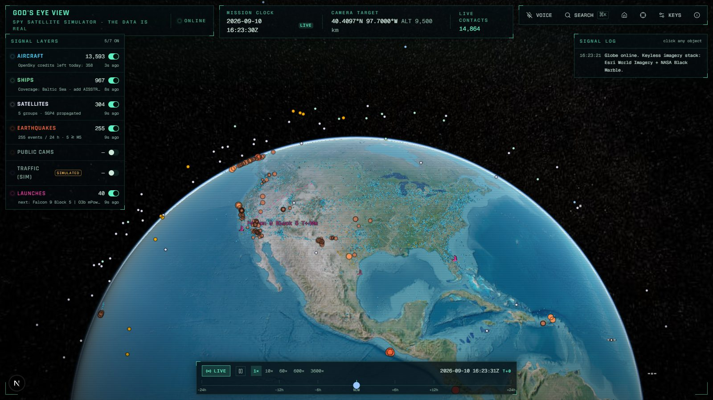
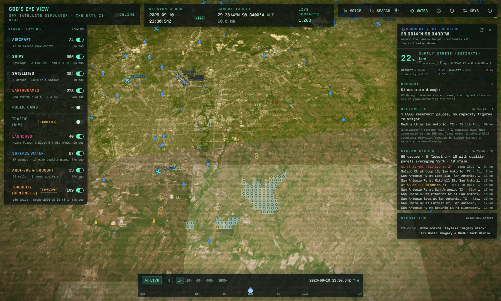
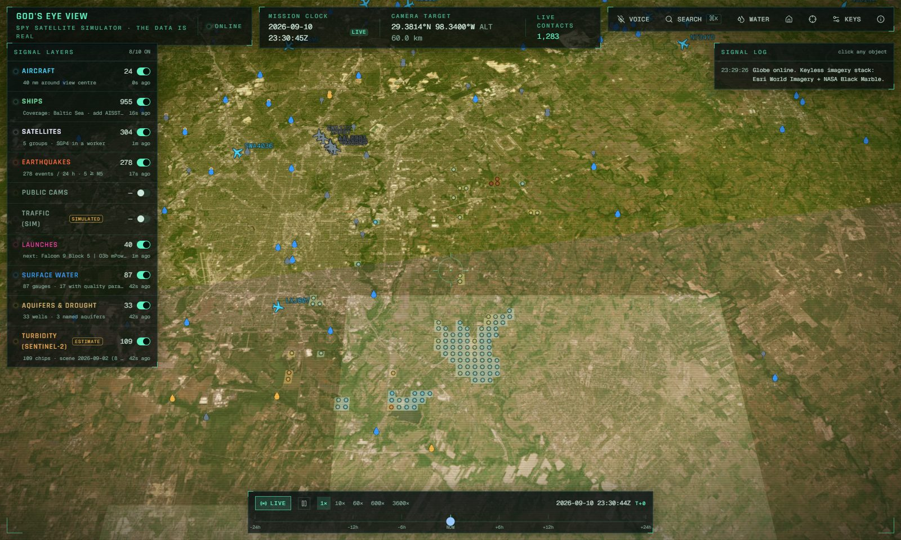
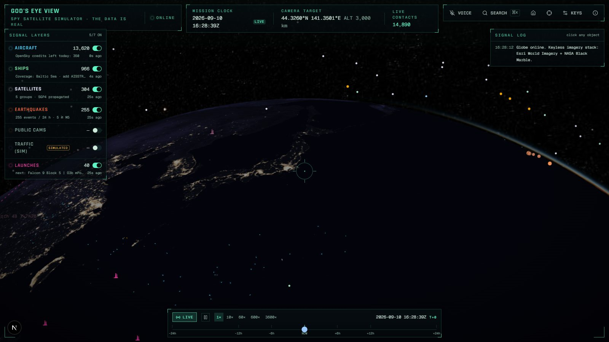
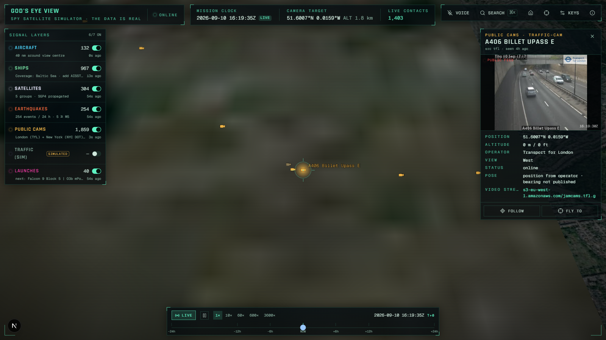
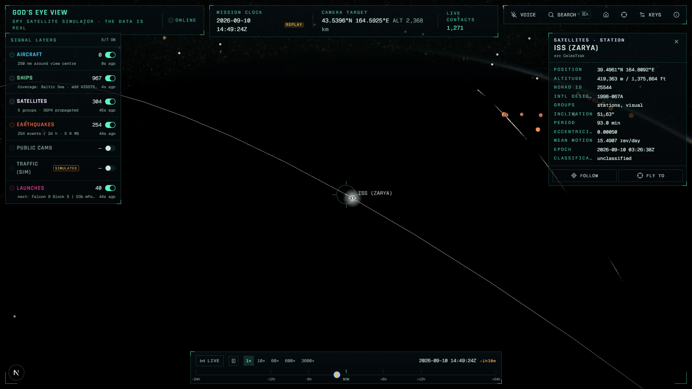
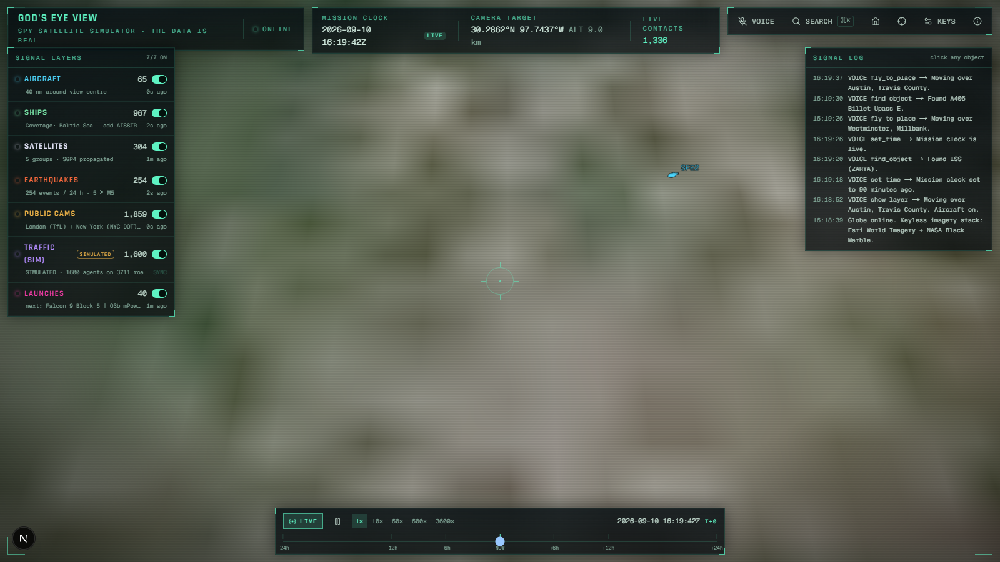

# God's Eye View

**A spy satellite simulator in your browser, except the data is real.**

A photorealistic 3D globe that fuses live public signals: every aircraft broadcasting ADS-B, ships on AIS, satellites propagated from CelesTrak elements, earthquakes as USGS reports them, open-data public cameras, upcoming rocket launches. And the thing the others don't do: **the water that keeps communities alive**. Rivers, lakes and reservoirs with their live gauges, the aquifers under them, this week's drought, and turbidity computed in your browser from the latest Sentinel-2 pass, with a community water report that shows its arithmetic. And, from the same public sources, **the economy in aggregate**: every harbour on Earth with US port volumes, every US land border crossing with monthly truck counts, countries shaded by trade with their partners drawn as arcs, and jobs, wages, home values and rents for every US county, with a market report that prints its formulas. Dark HUD, scanlines, cinematic camera, voice control. Starts with **zero API keys**. MIT licensed.

**Live:** https://eye.jcamd.com (also https://gods-eye-view-rust.vercel.app; deploys from `master`). One hosting caveat: OpenSky refuses Vercel's egress, so the zoomed-out aircraft view there falls back to adsb.lol around the view centre plus the military feed; run it locally or add OpenSky credentials for the full global picture.



| Community water report over San Antonio | Sentinel-2 turbidity chips on Calaveras and Braunig lakes |
| --- | --- |
|  |  |

| Night side, NASA Black Marble | Public camera dossier | Replay: ISS orbit at T−90 min | Traffic simulation |
| --- | --- | --- | --- |
|  |  |  |  |

## Water: rivers, lakes, aquifers, and what the satellite sees

Three layers and one report, all keyless, all labelled by what they are.

| Layer | What it holds | Where it comes from |
| --- | --- | --- |
| **Surface water** (on by default) | Rivers and lakes worldwide. Below 1,500 km camera altitude: every USGS stream and reservoir gauge in view with its latest flow, stage, temperature, dissolved oxygen, conductance, pH and turbidity; NWS flood category merged onto the gauge; Texas reservoirs with percent full. Each quality parameter is screened against a cited freshwater threshold and the site gets a **screening index** whose formula is printed next to it. Select a gauge for its 365-day trace and where today sits in it. | USGS Water Data API (`latest-continuous`, `daily`), NOAA NWPS, TWDB, Natural Earth 50 m |
| **Aquifers & drought** | This week's US Drought Monitor D0–D4 polygons draped on the terrain. Below 1,500 km: USGS monitoring wells with depth-to-water or water-level elevation and the **national aquifer each well taps** (Edwards, Ogallala, Floridan…). Select a well for its year of daily levels. | USGS Water Data API (`latest-daily`, `monitoring-locations`, `national-aquifer-codes`), USDM via the NDMC ArcGIS service |
| **Turbidity (Sentinel-2)** · ESTIMATE | Below 300 km over water: the browser finds the latest Sentinel-2 L2A scene on or before the mission clock (set the clock back, e.g. say "rewind 240 hours" or run `gev.run("set_time", { offset_minutes: -14400 })`, and it picks the newest scene before that time; the ±24 h slider rarely crosses a revisit), range-reads B04/B03/B08/B8A/SCL straight from the public COG bucket in a Web Worker, masks water, runs the Dogliotti (2015) semi-analytical turbidity algorithm on every water pixel and reports 640 m chips as median / p10–p90 FNU, drawn as a raster and as clickable chips. Where a USGS turbidity gauge sits inside a chip, its latest reading is shown next to the estimate, and its mean within ±2 h of the overpass when USGS still holds instantaneous values for that window, so the gap is visible. | Copernicus Sentinel-2 via Element 84 Earth Search (STAC + COGs), Dogliotti et al. 2015, USGS `continuous` |

**Community water report** (top bar → *Water*, or say "water report for San Antonio"): drought class at the camera target, capacity-weighted reservoir storage within 150 km, gauge flood status and quality within 75 km, wells and named aquifers within 75 km, satellite turbidity within 30 km, and a **supply-stress estimate** that prints its weights, its normalised terms and which terms were missing. Every line links to the feature it came from.

What the turbidity layer is and is not. It is the physics "teacher" that the TurbidityVision project (a separate, distilled LightGBM model; its explainer is the reference for the recipe below) learns from: T = A·ρw / (1 − ρw/C) with Dogliotti's published red (A 228.1, C 0.1641) and NIR (A 3078.9, C 0.2112) coefficients, blended between ρ_red 0.05 and 0.07, on the water mask SCL 6 ∪ (NDWI > 0.05 ∧ ρB08 < 0.10) minus cloud, shadow, snow and saturated classes. The distilled model's boosters are not bundled here. The numbers are estimates of a physical quantity from reflectance, not measurements, not regulatory values; the chip dossier says so, the layer tag says so, and the p10–p90 is the spread *inside* the chip, not model uncertainty.

Validation before shipping: the pipeline in `lib/water/` was run on the explainer's own Bexar County scene `S2A_14RNT_20250118_0_L2A` and reproduced its per-reservoir medians (Calaveras 4.47 vs 4.44 FNU, Braunig 4.02 vs 4.04, Mitchell Lake 15.98 vs 15.7). The same run settled the DN→reflectance question empirically: on this bucket ρ = DN/10000 passes the dark-water / land-NDVI / negative-fraction check and the STAC `offset −0.1` metadata does not (70 % negative reflectances), so the worker tries both conventions on every scene, keeps the one that passes and prints the check in the dossier.

## Trade, commerce and home values

Three more layers and a second report. Same rules: keyless, published values only, estimates labelled with their arithmetic, and **aggregates only** (counties, metros, states, harbours, ports of entry; never a parcel, an address or an owner).

| Layer | What it holds | Where it comes from |
| --- | --- | --- |
| **Ports & trade** | 3,807 harbours from the NGA World Port Index with size, harbour type, channel and pier depths, facilities and LOCODE (large ones from orbit, every one below 250 km). 45 of the 55 port authorities in the BTS Port Performance dataset (the ones that name a harbour city; ten river districts are left off) carry its statistics: container TEU and total tonnage by year with the national rank, imports / exports / empties, top commodities, vessel calls. Every US land port of entry with 25 months of trucks, trains, buses, personal vehicles and pedestrians (BTS Border Crossing Entry Data, latest month). Countries shaded by goods-and-services trade with GDP, exports, imports, trade share of GDP and container throughput from the World Bank; select a country and its top export markets and import sources arrive as arcs from WITS TradeStats. | NGA Pub 150 (bundled snapshot, `scripts/economy-data.mjs` refreshes it), data.bts.gov, World Bank WDI + WITS, Natural Earth 110 m |
| **Jobs & wages** | Every county (states above 2,500 km): establishments, third-month employment, total quarterly wages and the average weekly wage from the BLS Quarterly Census of Employment and Wages for the newest quarter published, with BLS's own over-the-year changes. Glyphs colour by the jobs change; select a county for its private-sector NAICS mix with location quotients. Cells BLS withholds stay blank. | BLS QCEW open-data CSV (`industry/10` for every area, `area/<fips>` on selection), Census TIGERweb generalized polygons |
| **Home values** · ESTIMATE | Every county Zillow models (about 3,070) filled by the one-year change in the typical home value, with the five-year change, the typical rent where ZORI covers it (about 1,390 counties), price-to-rent, and on selection a ten-year trace against the national value plus a **mortgage-against-wages** line: principal and interest on the typical home at this week's Freddie Mac rate, as a share of one average job's pay in that county, with the formula printed. | Zillow Research ZHVI and ZORI public CSVs (data through Zillow), FRED `MORTGAGE30US`, Census TIGERweb |

**Market report** (top bar → *Market*, or say "market report for Austin"): the county under the camera target with its home value and rent changes against the metro and the nation, the affordability estimate, jobs and wages with the sectors concentrated there, the ports and border crossings within 200–250 km ranked by volume, a national pulse from FRED and the BTS supply-chain indicators (mortgage rate, unemployment, retail sales, trade balance, housing starts, Case-Shiller, containerized imports, Shanghai→LA box rate, ships waiting for a berth, diesel), and a **momentum index**: a weighted mean of the published one-year changes in home values, rents, jobs and wages, each clipped to a stated scale, weights printed, missing terms listed. It is an index of published changes, not a forecast and not advice.

Where the numbers come from and what was checked before shipping: the Census Bureau's data API now requires a key, so nothing here uses it; county geometry comes from TIGERweb's generalized services, which answered a Texas-sized box (429 counties at 1:20M) in about half a second. BLS QCEW answered 2026 Q1 for all 3,275 county totals with no suppressed county totals (sector cells can be). Zillow's county file carried a July 2026 value for all 3,071 counties and a five-year comparison for 3,020. BTS port authorities were placed by matching their harbour city to a World Port Index entry within 150 km of the geocoded city; the four with no WPI entry (Palm Beach district, Pittsburgh, South Louisiana, St. Louis) sit at the city and say so in the dossier; ten river districts that name no city are left off. WITS's newest bilateral year was 2023 at the time of writing, and the arcs say which year they are.

## For practitioners: history, screens, signals, releases, watchlists, desk mode

The globe is the front door; the rest of this section is for analysts, economists and traders who need the same public numbers as time series, tables and feeds. Every route below is keyless, CORS-open, returns a provenance envelope (`data`, `provenance[]`, `generatedAt`, `caveats[]`), answers `format=csv` where the payload is tabular, and is described at [`/api/openapi`](https://eye.jcamd.com/api/openapi). The practitioner guide is [`docs/API.md`](docs/API.md).

| What | Where | Notes |
| --- | --- | --- |
| **Nowcast series from the live feeds** | `/api/series`, [`docs/SNAPSHOTS.md`](docs/SNAPSHOTS.md) | A GitHub Actions cron samples the feeds every three hours and commits counts to `data/series/`: vessels within reach of 54 major ports (all, stationary, moving), aircraft over 19 cargo hubs (all, cargo carriers), eight river gauges, Texas reservoir storage, daily earthquake counts. Counts only, never an MMSI or a hex code. Read with `op=get&id=snapshot:port-vessels-stationary:USLAX&rollup=daily-mean`. |
| **Backfilled indices** | `/api/economy/history`, [`docs/HISTORY.md`](docs/HISTORY.md) | Ten years of monthly ZHVI and ZORI, quarterly QCEW jobs, wages and establishments, the weekly Freddie Mac rate, and the momentum and affordability indices computed for every month, per county or nationally. `op=ic&h=12` runs a cross-sectional information-coefficient test of the home-only momentum signal against the next twelve months of home-value change. Descriptive, not a forecast. |
| **Screener** | `/api/screen`, [`docs/SCREENER.md`](docs/SCREENER.md), top bar → *Screen* | Rank and filter every county, state, harbour, land crossing or country: `kind=county&q=home.yoyPct>5 AND jobs.yoy.emp<0 SORT momentum DESC LIMIT 50`. Percentile ranks with `pct=1`, a field registry with `fields=1`, six presets in the panel, click a row to fly there, `?screen=county:<query>` shares one. |
| **Named indicators** | `/api/indicators`, [`docs/INDICATORS.md`](docs/INDICATORS.md), top bar → *Signals* | Nineteen signals with thresholds and a why-it-matters line: Mississippi at Memphis and St. Louis, Ohio at Louisville, Missouri at St. Joseph, Hoover releases, Texas reservoirs, Laredo trucks, LA + Long Beach TEU, ships waiting for a berth, the Shanghai–LA box rate, diesel, WTI, the 30-year mortgage rate, starts, permits, Case-Shiller, unemployment (Sahm-style), the trade balance, retail sales. Levels marked *convention* are ours, not official. |
| **Release calendar, vintages, movers** | `/api/releases`, [`docs/RELEASES.md`](docs/RELEASES.md), top bar → *Releases* | When each table changes (official schedules where they exist, windows where they do not), which release of each table is loaded now, and the biggest movers since the previous release for home values, jobs, border trucks and port TEU. Permalinks accept `&v=YYYY-MM-DD` to pin a vintage; the HUD shows `VINTAGE`. |
| **Watchlists and alerts** | `/api/watch`, [`docs/WATCHLISTS.md`](docs/WATCHLISTS.md), top bar → *Watch* | Counties, ports, crossings, gauges, series, indicators or companies with rules (`home.yoyPct >= 3`, `stage crosses_above 8`, `value changes_by_pct -10 over 7d`) as RSS, Atom, JSON Feed or JSON. The token in the URL is the list itself, so the server keeps nothing; treat the URL as a secret. With `GEV_CRON_SECRET` set, fired rules go to an https webhook signed with `X-GEV-Signature`. |
| **MCP server, Python client, notebook** | `/api/mcp`, [`docs/MCP.md`](docs/MCP.md), [`examples/`](examples/) | `claude mcp add --transport http gev https://eye.jcamd.com/api/mcp` (or `claude mcp add gev -- node scripts/mcp-stdio.mjs` locally): 24 read-only tools, the docs and OpenAPI document as resources, three prompts (county due diligence, port congestion check, water stress brief). `examples/gev.py` is a dependency-free client; the notebook walks Texas counties into pandas. |
| **Desk mode** | `?mode=desk` or press `D`, [`docs/DESK.md`](docs/DESK.md) | A light, dense analyst workspace: the globe on the left, a resizable pane with a sortable table of every loaded feature (CSV, TSV to clipboard), a multi-series chart fed by the series store, indicators and county history (dual axes, normalise to 100, PNG/CSV), the two reports as printable documents, and notes that copy out as markdown with a permalink and citations. Scanlines and drift are off while it is on. |

**Public companies, banks and federal dollars.** Three more layers from regulators' own APIs, all keyless and public domain: every listed company in SEC EDGAR at its registered business address (filings, XBRL revenue, income, assets, equity, cash and debt with their periods, ratios that print their formulas, a sector-to-ETF bridge stated as a convention; `/api/companies`, [`docs/COMPANIES.md`](docs/COMPANIES.md)); every FDIC-insured office with Summary of Deposits, a county's deposit market with the top banks and an HHI, quarterly ROA, ROE and noncurrent loans per institution, bank failures by year; and USAspending obligations by county and award family for the latest complete fiscal year with dollars per covered job, top recipients, awarding agencies and NAICS mix (`/api/finance`, [`docs/FINANCE.md`](docs/FINANCE.md)). Company-level and institution-level only: no officers, insiders or shareholders. The market report lists the companies headquartered in the county, its jobs mix folded into GICS sectors, and where the finance section is wired, its deposit market and federal dollars. The companies layer ships with a 25-company fixture; `node scripts/companies-data.mjs` builds the full bundle from EDGAR (about 6,000 filers at the SEC's 8 requests per second).

## Explore it

Every view is a link. **Share** in the top bar copies one that carries the camera target, the layers, the mission clock and the selected object; **Explore** opens curated places, a guided tour, and exports.

| Start here | What loads |
| --- | --- |
| [Calaveras & Braunig, San Antonio](https://eye.jcamd.com/?lat=29.28&lon=-98.34&h=60000&layers=water,turbidity,groundwater&report=1) | Sentinel-2 turbidity chips beside USGS turbidity gauges, with the community water report open |
| [Edwards Aquifer wells](https://eye.jcamd.com/?lat=29.42&lon=-98.49&h=120000&layers=water,groundwater&report=1) | Wells named by aquifer, drought class, gauges with full quality panels |
| [Highland Lakes, Austin](https://eye.jcamd.com/?lat=30.4&lon=-97.9&h=120000&layers=water,groundwater&report=1) | TWDB reservoirs with percent full; the report weights storage by capacity |
| [Lake Mead & Hoover Dam](https://eye.jcamd.com/?lat=36.05&lon=-114.74&h=150000&layers=water,turbidity,groundwater) | Dozens of turbidity and oxygen gauges plus satellite chips |
| [Chesapeake Bay](https://eye.jcamd.com/?lat=38.95&lon=-76.45&h=120000&layers=water,turbidity) | Estuary turbidity, gauges on the tributaries |
| [Western Lake Erie](https://eye.jcamd.com/?lat=41.7&lon=-83.4&h=150000&layers=water,turbidity,groundwater) | Open-water chips, Maumee gauges, inland wells |
| [Lake Okeechobee](https://eye.jcamd.com/?lat=26.95&lon=-80.8&h=150000&layers=water,turbidity,groundwater) | Canal gauges, basin wells, lake chips |
| [Mississippi & Atchafalaya](https://eye.jcamd.com/?lat=30&lon=-91.3&h=200000&layers=water,groundwater) | NWS flood categories along the lower river |
| [Rio Grande at El Paso](https://eye.jcamd.com/?lat=31.75&lon=-106.5&h=120000&layers=groundwater,water&report=1) | A groundwater story: wells, aquifers, drought |
| [The planet's water](https://eye.jcamd.com/?lat=30&lon=-97.7&h=12000000&layers=water,groundwater) | Every named river and lake with this week's drought classes |
| [Who trades with whom](https://eye.jcamd.com/?lat=25&lon=-40&h=16000000&layers=trade) | Countries shaded by trade; click one for its partners as arcs |
| [Los Angeles & Long Beach](https://eye.jcamd.com/?lat=33.76&lon=-118.22&h=90000&layers=trade,commerce,realestate&market=1) | The two busiest container ports with their TEU history, and the market report |
| [Laredo crossings](https://eye.jcamd.com/?lat=27.55&lon=-99.5&h=160000&layers=trade,commerce) | The busiest truck crossing in North America, 25 months of counts |
| [Austin housing](https://eye.jcamd.com/?lat=30.3&lon=-97.75&h=160000&layers=realestate,commerce&market=1) | Counties by one-year home value change, rents, wages, the mortgage-against-wages estimate |
| [Fifty states](https://eye.jcamd.com/?lat=39&lon=-97&h=6500000&layers=realestate,commerce) | Every state by home value change with statewide jobs and wages |

Link parameters: `lat`, `lon`, `h` (camera height in metres), `hd` / `p` (heading, pitch), `layers` (comma list of layer ids, exactly these on), `t` (mission clock, ISO; omitted while live), `sel=layer:id` (selected object, best effort once its feed loads), `report=1` (water report open), `market=1` (market report open), `embed=1` (no HUD chrome, for iframes; data credits stay).

Embed it:

```html
<iframe src="https://eye.jcamd.com/?lat=29.28&lon=-98.34&h=60000&layers=water,turbidity&embed=1"
        width="960" height="600" style="border:0" allow="clipboard-write" loading="lazy"></iframe>
```

Take the data with you: **Explore → Take the data with you** saves every loaded gauge reading as CSV, the turbidity chips as GeoJSON polygons with scene provenance, every loaded county or state with its home value, rent, jobs and wages as CSV, and the loaded harbours and crossings with their volumes as CSV; both reports have copy-as-text and JSON buttons in their headers.

## Use the data without the globe

`/api/water` is a keyless, CORS-open JSON API over the same public sources, edge-cached by op. Call it from a notebook, a script or your own page:

```bash
# Community water report for a point (drought, reservoirs, gauges, wells, stress estimate with its formula)
curl "https://eye.jcamd.com/api/water?op=report&lon=-98.49&lat=29.42"

# Latest USGS gauge readings in a box (flow, stage, temp, DO, conductance, pH, turbidity, reservoir level/storage)
curl "https://eye.jcamd.com/api/water?op=gauges&bbox=-98.6,29.2,-98.2,29.6"
curl "https://eye.jcamd.com/api/water?op=gauges&bbox=-98.6,29.2,-98.2,29.6&param=63680"   # turbidity only

# NWS flood categories, Texas reservoirs, USGS wells with aquifer names, this week's Drought Monitor polygons
curl "https://eye.jcamd.com/api/water?op=nwps&bbox=-98.6,29.2,-98.2,29.6"
curl "https://eye.jcamd.com/api/water?op=twdb"
curl "https://eye.jcamd.com/api/water?op=wells&bbox=-98.6,29.2,-98.2,29.6"
curl "https://eye.jcamd.com/api/water?op=drought"

# One site: 365 days of daily means, or instantaneous values in a window
curl "https://eye.jcamd.com/api/water?op=history&site=USGS-08180800&param=00060"
curl "https://eye.jcamd.com/api/water?op=matchup&site=USGS-08181500&param=63680&from=2026-09-02T15:25:56Z&to=2026-09-02T19:25:56Z"
```

`/api/economy` does the same for trade, jobs and home values:

```bash
# Market report for a point: home values vs metro and nation, rents, affordability estimate with its formula,
# jobs and sector concentration, nearest ports and crossings, national pulse, momentum index
curl "https://eye.jcamd.com/api/economy?op=report&lon=-97.75&lat=30.3"

# Counties in a box (jobs, wages, home values, rents, geometry), or every state
curl "https://eye.jcamd.com/api/economy?op=areas&bbox=-98.5,29.8,-97,31"
curl "https://eye.jcamd.com/api/economy?op=areas&level=state"

# One county's private-sector NAICS mix with location quotients; the same plus metro / state / US home values
curl "https://eye.jcamd.com/api/economy?op=sectors&fips=48453"
curl "https://eye.jcamd.com/api/economy?op=context&fips=48453"

# Harbours in a box (min=large|medium|small|all) with BTS volumes; every US land border crossing
curl "https://eye.jcamd.com/api/economy?op=ports&bbox=-96,28.5,-93.5,30.5&min=all"
curl "https://eye.jcamd.com/api/economy?op=border"

# Countries with World Bank indicators; a country's top partners; the national pulse
curl "https://eye.jcamd.com/api/economy?op=countries"
curl "https://eye.jcamd.com/api/economy?op=partners&iso3=USA"
curl "https://eye.jcamd.com/api/economy?op=pulse"
```

Every response carries `provenance` (one record per upstream release, estimates with their formula) and `generatedAt`; tabular ops answer `format=csv` with the same provenance as `#` footer lines (`pd.read_csv(url, comment="#")`). The practitioner routes (`/api/series`, `/api/economy/history`, `/api/screen`, `/api/indicators`, `/api/releases`, `/api/watch`, `/api/companies`, `/api/finance`, `/api/mcp`) follow the same envelope; see the section above and `/api/openapi`.

Water boxes are clamped to 4° and snapped to a 0.5° grid, economy boxes to 18° and a 1° grid, so nearby callers share a cache entry. Responses carry `source`, `cacheAge` and, for the report, `globe`: the permalink that opens the same point on the globe. The report from the API has no satellite turbidity term (that runs in a browser) and says so in `caveats`. Please keep the upstreams' terms in mind; the route already rate-gates and backs off on their behalf.

## Quick start

```bash
git clone https://github.com/jcdavis131/gods-eye-view
cd gods-eye-view
npm install        # also copies Cesium's static assets into public/cesium
npm run dev        # http://localhost:3000
```

That is the whole setup. No account, no token, no `.env`. Everything below the fold works on free public endpoints.

Pinokio users: add this folder (or the repo URL) in Pinokio and press **Install**, then **Start**. `pinokio.js`, `install.js`, `start.js`, `update.js` and `reset.js` are in the repo root.

## What you get with no keys

| Layer | Source (no key) | Refresh | Notes |
| --- | --- | --- | --- |
| Aircraft | [adsb.lol](https://adsb.lol) point query (≤ 250 nm around the view) + its global military-flagged feed; [OpenSky](https://opensky-network.org) when zoomed out | 10 s | Positions are dead-reckoned between reports for up to 90 s. OpenSky anonymous quota is 400 credits/day; the server caches 90 s and the HUD shows credits left. |
| Ships | [Digitraffic](https://www.digitraffic.fi/en/marine-traffic/) (Fintraffic) AIS | 20 s | Real AIS, **Baltic Sea coverage**. No mock ships anywhere; the layer says what it covers. |
| Satellites | [CelesTrak](https://celestrak.org) GP elements, SGP4 via satellite.js | 2 h | Fully time-scrubbable. Propagation runs in a Web Worker, so the ~11k "all active" group (opt-in) stays smooth. Default groups: stations, brightest, GPS, military, weather. |
| Earthquakes | [USGS](https://earthquake.usgs.gov) all-magnitudes, past 24 h | 60 s | Sized and coloured by magnitude. |
| Public cams | [TfL JamCams](https://api-portal.tfl.gov.uk) + [NYC DOT](https://webcams.nyctmc.org) | 5 min | Open-data traffic cameras with live stills in the info panel. Positions only. |
| Traffic (sim) | OpenStreetMap roads via Overpass; vehicles are **simulated** | 10 min | Labelled SIMULATED everywhere. See [Ethics](#ethics-guardrails). Activates below 30 km camera altitude. |
| Launches | [Launch Library 2](https://thespacedevs.com) upcoming + recent | 15 min | Pads, countdowns, a coarse estimated ascent arc, an animated vehicle for T+0 to T+10 min. |
| Surface water | [USGS Water Data API](https://api.waterdata.usgs.gov) + [NOAA NWPS](https://api.water.noaa.gov) + [TWDB](https://www.waterdatafortexas.org/reservoirs) + Natural Earth | 5 min | Rivers/lakes always; gauges, flood status and reservoirs below 1,500 km. Quality screening against EPA freshwater criteria with the formula shown. |
| Aquifers & drought | USGS wells + aquifer codes, [US Drought Monitor](https://droughtmonitor.unl.edu) | 30 min | Drought polygons always; wells below 1,500 km. Depth-to-water reads inverted (deeper is drier) and says so. |
| Turbidity (Sentinel-2) | [Earth Search](https://earth-search.aws.element84.com/v1) STAC + `sentinel-cogs` bucket, computed in-browser | 1 h / per scene | ESTIMATE. Dogliotti 2015 physics on the latest low-cloud scene before the mission clock; 640 m chips with in-situ USGS matchups. Activates below 300 km. |
| Ports & trade | [NGA World Port Index](https://msi.nga.mil/Publications/WPI) (bundled), [BTS](https://data.bts.gov) port performance + border crossings, [World Bank WDI](https://data.worldbank.org) + [WITS](https://wits.worldbank.org), Natural Earth | 1 h | Harbours by size as you descend; every land crossing below 6,000 km; countries always. Partner arcs on selection. |
| Jobs & wages | [BLS QCEW](https://www.bls.gov/cew/) open-data CSVs, Census TIGERweb | 1 h | Newest quarter published; withheld cells stay blank. Sector mix with location quotients on selection. |
| Home values | [Zillow Research](https://www.zillow.com/research/data/) ZHVI + ZORI (data through Zillow), FRED mortgage rate | 6 h | ESTIMATE. County and state aggregates only. Ten-year trace and mortgage-against-wages line on selection. |
| Public companies | [SEC EDGAR](https://www.sec.gov/search-filings/edgar-application-programming-interfaces) tickers, submissions, XBRL company facts and frames (bundled snapshot), Census ZCTA-to-county file, TIGERweb | 6 h / 12 h on selection | HQ points below 3,000 km coloured by sector, labelled by ticker. Filings and annual facts on selection. No insiders. |
| Banks | [FDIC BankFind Suite](https://banks.data.fdic.gov/docs/) institutions, locations, Summary of Deposits, financials | 6 h | Every insured office below 300 km with deposits per office; county deposit market and HHI (ESTIMATE, formula printed) on selection. |
| Federal spending | [USAspending](https://api.usaspending.gov/) spending by geography, category and over time | 12 h | Counties below 2,500 km, states above, coloured by obligations per covered job (ESTIMATE). Recipients, agencies, NAICS and a six-year trace on selection. |
| Globe | Esri World Imagery + NASA GIBS Black Marble night lights | — | Day/night lighting, atmosphere, fog, stars. |

## Optional keys (all entered in the app, none required)

Press **Keys** in the top bar or hit `,`. Keys live in `localStorage` and are only ever sent to this app's own `/api` routes (as request headers) or to the vendor SDK they belong to (voice).

| Key | Unlocks |
| --- | --- |
| `GOOGLE_MAPS_API_KEY` | Google Photorealistic 3D Tiles (buildings, trees, terrain). |
| `CESIUM_ION_TOKEN` | Cesium World Terrain. |
| `ADSBX_RAPIDAPI_KEY` | ADS-B Exchange as an alternative aircraft source. |
| `OPENSKY_CLIENT_ID` / `OPENSKY_CLIENT_SECRET` | 4000 OpenSky credits/day for the global view. |
| `AISSTREAM_KEY` | Global AIS via [AISStream](https://aisstream.io) websocket (free key). |
| `WINDY_WEBCAMS_KEY` | Windy public webcams worldwide, nearest 50 to the view. |
| `ELEVENLABS_AGENT_ID` (+ `ELEVENLABS_API_KEY` for private agents) | ElevenLabs Conversational AI voice agent. |
| `VAPI_PUBLIC_KEY` + `VAPI_ASSISTANT_ID` | Vapi realtime voice agent. |

## Controls

- Drag to orbit, scroll to zoom, middle-drag or ctrl-drag to tilt.
- Click any object for its dossier; **Follow** locks the camera to it (your orbit offset is kept while it moves).
- `⌘K` / `Ctrl+K` search flights, ships, satellites and cameras by callsign, name, MMSI, ICAO hex or NORAD id, or geocode a place.
- **Explore** opens curated places, the guided tour and exports; **Share** copies a permalink to exactly this view.
- Timeline scrubs ±24 h. Satellites and launches propagate to any time. Live layers hold their last known state and are flagged `LAST KNOWN`; nothing is synthesised for the past.
- Idle for 12 s and the camera drifts in orbit (cinematic mode, toggle in settings).
- `D` toggles desk mode. Top bar: **Signals** (indicators), **Screen** (screener), **Releases** (calendar, vintages, movers), **Watch** (watchlists); the strip is icon-only with tooltips and scrolls sideways on narrow screens.
- On a phone (or a short landscape viewport) the HUD stacks: a one-row header with voice, search and settings; a bottom strip of panel toggles (Layers, Water, Market, Signals, Screen, Releases, Watch, Explore, Share); a compact timeline that unfolds on tap; and one bottom sheet that holds every open panel, with a handle to make it taller and an X that closes everything. Pinch and drag work on the globe as usual.
- Voice: press **Voice** and say "show me flights over Austin", "track the ISS", "rewind 30 minutes", "go live", "what am I looking at", "show me aquifers", "water report for San Antonio", "market report for Austin", "show me ports", "home values in Denver", "explore Lake Mead", "start the tour", "show companies", "show banks", "show federal spending", "open the screener", "screen counties where rents rising and jobs falling", "show indicators", "release calendar", "what changed", "open my watchlist", "watch this", "pin vintage 2026-08-15", "desk mode".

## Voice control

Three providers share one command registry (`lib/voice/commands.ts`):

| Provider | Needs | How |
| --- | --- | --- |
| Browser (default) | nothing | Web Speech API + a small local intent parser (`lib/voice/intent.ts`). Chrome/Edge/Safari. |
| ElevenLabs | agent id | Conversational AI agent; every command is registered as a **client tool** so the agent calls the globe directly. |
| Vapi | public key + assistant id | Web SDK call; function tools are advertised on the call as async client tools and results are posted back as system messages. |

For ElevenLabs and Vapi, configure tools on the vendor side with these names and schemas (also available at runtime as `window.gev.commands` and `toolDefinitions()`):

```json
[
  { "name": "fly_to_place",    "parameters": { "place": "string", "altitude_km": "number?" } },
  { "name": "show_layer",      "parameters": { "layer": "aircraft|ships|satellites|earthquakes|cameras|traffic|launches|water|groundwater|turbidity", "on": "boolean", "place": "string?" } },
  { "name": "find_object",     "parameters": { "query": "string", "follow": "boolean?" } },
  { "name": "follow_selected", "parameters": { "on": "boolean" } },
  { "name": "set_time",        "parameters": { "offset_minutes": "number?", "live": "boolean?" } },
  { "name": "home_view",       "parameters": {} },
  { "name": "water_report",    "parameters": { "place": "string?" } },
  { "name": "explore_preset",  "parameters": { "preset": "string?", "tour": "boolean?" } },
  { "name": "describe_view",   "parameters": {} },
  { "name": "open_panel",      "parameters": { "panel": "screener|indicators|releases|movers|watchlist|desk|hud", "on": "boolean?" } },
  { "name": "screen",          "parameters": { "kind": "county|state|port|crossing|country", "query": "string" } },
  { "name": "watch_selected",  "parameters": {} },
  { "name": "set_vintage",     "parameters": { "date": "string?" } }
]
```

Vapi tools must be marked `async: true` (the browser executes them; there is no server webhook).

## Architecture

```
 browser ─────────────────────────────────────────────────────────────────────────────┐
 │                                                                                    │
 │  components/hud/*          HUD: layer panel, info panel, timeline, search, voice   │
 │        │  zustand (lib/store)                                                      │
 │        ▼                                                                           │
 │  components/globe/LayerHost.tsx   one tanstack-query per enabled layer             │
 │        │  fetch() → GeoJSON FeatureCollection                                      │
 │        ▼                                                                           │
 │  lib/layers/<name>.ts     normalise upstream JSON → GeoJSON (pure, inspectable)    │
 │        │                                                                           │
 │        ▼                                                                           │
 │  lib/globe/renderer.ts    LayerRenderer: billboards / points / polylines / labels /│
 │                           ground polygons / raster overlay                         │
 │  lib/water/*              Dogliotti physics, UTM, quality screening, water report; │
 │                           turbidity.worker.ts reads Sentinel-2 COGs in a Worker    │
 │  lib/globe/styles.ts      glyph, colour, label, position-at-time per layer         │
 │        │                                                                           │
 │        ▼                                                                           │
 │  components/globe/CesiumGlobe.tsx   CesiumJS viewer, imagery, picking, follow,     │
 │                                     cinematic drift, clock sync                    │
 └─────────────────────┬──────────────────────────────────────────────────────────────┘
                       │ fetch /api/*  (optional keys travel as x-gev-* headers)
                       ▼
 app/api/<layer>/route.ts   thin proxies: CORS, polite User-Agent, gzip, in-memory
                            TTL cache, per-upstream rate gate, 429 back-off
 app/api/{series,screen,indicators,releases,watch,companies,finance,economy/history}
                            practitioner API: provenance envelopes, CSV, OpenAPI at /api/openapi
 app/api/mcp/route.ts       MCP (Streamable HTTP, stateless) over the same routes
 lib/series/*               time-series store (file, GitHub raw, memory) + snapshot collectors
 .github/workflows/snapshot.yml  cron that commits data/series every three hours
                       │
                       ▼
 adsb.lol · OpenSky · Digitraffic · AISStream · CelesTrak · USGS · TfL · NYC DOT ·
 Windy · Launch Library 2 · Overpass · Nominatim · Esri · NASA GIBS · Google · Cesium ion ·
 USGS Water Data · NOAA NWPS · TWDB · US Drought Monitor · (browser-direct, CORS *:)
 Earth Search STAC · sentinel-cogs S3
```

Why proxies at all? OpenSky locks CORS to its own origin, adsb.lol and Overpass send no CORS headers, Nominatim requires a User-Agent browsers cannot set, Digitraffic requires gzip plus a client header, and CelesTrak asks for at most one fetch per group every two hours. The routes pass upstream JSON through untouched (two big payloads are trimmed and say so with `trimmed: true`), so the network tab is the audit trail.

Open the console and type `gev` for a live handle: `gev.globe.getState()`, `gev.features()`, `gev.say("show me ships near Helsinki")`, `gev.run("set_time", { offset_minutes: -60 })`.

## Layer API

A layer is one file in `lib/layers/` exporting a `LayerDefinition`:

```ts
import type { LayerDefinition, FetchContext, FetchResult } from "./types";

export const myLayer: LayerDefinition = {
  id: "mything",                 // add to LayerId in lib/layers/types.ts
  label: "My thing",
  description: "Where it comes from and what it means.",
  color: "#7CFFB2",
  updateIntervalMs: 30_000,
  defaultEnabled: false,
  viewDependent: true,           // refetch when the camera settles somewhere new
  viewKey: (view) => `${view.lon.toFixed(1)},${view.lat.toFixed(1)}`, // optional, coarse by default
  simulated: false,              // true ONLY for simulations; shown loudly in the UI
  timeDependent: false,          // true to refetch when the mission clock changes day (satellite scenes)
  estimate: undefined,           // short caption when the layer computes rather than relays; shows an ESTIMATE tag
  attribution: "Upstream name (licence)",
  async fetch(ctx: FetchContext): Promise<FetchResult> {
    // ctx.view = camera target/height/bbox, ctx.keys = optional operator keys,
    // ctx.now = wall clock, ctx.missionTime = timeline clock, ctx.signal = abort,
    // ctx.options = settings prefs
    const res = await fetch(`/api/mything?...`, { signal: ctx.signal });
    const data = await res.json();
    return {
      collection: { type: "FeatureCollection", features: [/* GeoJSON Features with BaseProps */] },
      source: "upstream name",
      fetchedAt: Date.now(),
      note: "coverage caveat shown in the HUD",
    };
  },
};
```

Every feature carries `BaseProps` (`lib/layers/types.ts`): `id`, `layer`, `name`, optional `kind`, `heading`, `altitude`, `speed`, `observedAt`, `source`, `simulated`, `details` (rendered verbatim in the info panel), `imageUrl`, `extra`.

Register it in `lib/layers/index.ts` and give it a `LayerStyle` in `lib/globe/styles.ts`:

```ts
export const myStyle: LayerStyle = {
  color: "#7CFFB2",
  icon: (f) => "dot",                       // glyph from lib/globe/icons.ts, or null for a point
  label: (f) => f.properties.name,
  labelMax: 60,                             // label everything while the layer is small
  trail: true,                              // keep a position history for the selected object
  position: (f, timeMs) => [lon, lat, alt], // optional: moving objects
  selectedLines: (f, timeMs) => [{ positions, color, width }], // optional: orbit / track
  lines: (f) => [{ positions, color, alpha }],      // optional: polylines (rivers, roads); Multi* geometries work
  polygons: (f) => [{ rings, color, alpha }],       // optional: filled ground polygons (drought classes)
  overlay: (features) => ({ image, west, south, east, north }), // optional: one raster over the collection
  labelAlways: (f) => f.properties.kind === "major", // optional: keep a label regardless of labelMax
};
```

Rules the codebase keeps: never invent a value the upstream did not send (unknown heading stays `undefined`, AIS sentinels 511/360 are dropped), never count simulated features as live, never let a key reach third-party JavaScript except the SDK it belongs to.

## Contributing

See [CONTRIBUTING.md](CONTRIBUTING.md): the ground rules (public infrastructure only, never invent a value, keyless first, polite to upstreams), how to add a layer or an Explore preset, and how to report a wrong number with a permalink.

## Ethics guardrails

This project shows **public infrastructure and public events** only. It is a way to look at the world's shared systems, not at people.

- No face recognition, no person tracking, no named-individual search, no licence plates, no phone signals. There is no code path that identifies a human being and none will be merged.
- Cameras are limited to operator-published open data (transport agencies, public webcams). Only their published position is used; **all camera poses are coarse position estimates and no orientation is drawn** because none is published.
- The traffic layer is a simulation on real roads driven by an aggregate demand curve. It never ingests real vehicle, phone or plate data and is labelled `SIMULATED` on the layer, on every feature, in the info panel and here.
- No fabricated fallbacks. When a feed is unavailable the layer says so; when coverage is partial (AIS without a key is the Baltic Sea) the layer says that too.
- Aircraft with privacy programmes (PIA/LADD) appear only as their upstream publishes them; this app adds no de-anonymisation.
- Economic layers are about places and institutions, not people. Counties, metros, states, harbours, ports of entry, and now public companies, banks and federal awards as their regulators publish them: SEC EDGAR filings and XBRL facts at a company's registered business address, FDIC institutions and branch deposits, USAspending recipients and agencies. No parcel values, no home addresses, no owners, no listings, no insider or officer names from Forms 3/4/5, no shareholder names. Zillow indexes are labelled as model estimates; the affordability, momentum, HHI and per-job lines print their formulas; the sector-to-ETF bridge is a stated convention. None of it is investment, lending or relocation advice.

If you build on this, keep the list above intact. It is the point.

## Data sources and attribution

adsb.lol (ODbL) · OpenSky Network · ADS-B Exchange · Fintraffic / Digitraffic (CC BY 4.0) · AISStream.io · CelesTrak · USGS Earthquake Hazards Program · USGS Water Data API (public domain) · NOAA National Water Prediction Service · Texas Water Development Board · U.S. Drought Monitor (National Drought Mitigation Center, USDA, NOAA) · Natural Earth (public domain) · Copernicus Sentinel-2 L2A (ESA, free and open) via Element 84 Earth Search and the AWS `sentinel-cogs` registry of open data · Dogliotti, A. I., Ruddick, K. G., Nechad, B., Doxaran, D., Knaeps, E. (2015), *A single algorithm to retrieve turbidity from remotely-sensed data in all coastal and estuarine waters*, Remote Sensing of Environment 156, 157–168 · Benson & Krause (1984) for oxygen saturation · EPA National Recommended Water Quality Criteria for the screening thresholds · Transport for London Open Data · NYC DOT · Windy.com · The Space Devs Launch Library 2 · OpenStreetMap contributors (ODbL) via Overpass and Nominatim · Esri World Imagery (Esri, Maxar, Earthstar Geographics, GIS User Community) · NASA GIBS / VIIRS Black Marble · Zillow Research ZHVI and ZORI (data through Zillow, free for public use with attribution) · U.S. Bureau of Labor Statistics QCEW (public domain) · U.S. Census Bureau TIGERweb (public domain) · U.S. Bureau of Transportation Statistics: Border Crossing Entry Data, Port Performance Freight Statistics, Supply Chain and Freight Indicators (public domain) · NGA World Port Index, Pub 150 (public domain) · World Bank World Development Indicators and WITS TradeStats (CC BY 4.0) · FRED, Federal Reserve Bank of St. Louis (series from Freddie Mac, Census, BEA, EIA, BLS, S&P Dow Jones) · U.S. Securities and Exchange Commission EDGAR APIs (public domain; fair-access policy) · Federal Deposit Insurance Corporation BankFind Suite (public domain) · USAspending.gov (public domain) · U.S. Census Bureau ZCTA-to-county relationship file · CesiumJS (Apache 2.0) · satellite.js (MIT) · geotiff.js (MIT).

Please respect each upstream's rate limits and terms; the proxies already do (server-side caches, one request at a time per upstream, back-off on 429).

## Development notes

- Next.js 16 (Turbopack), React 19, Tailwind 4, shadcn (base-ui), Zustand, TanStack Query, CesiumJS 1.145, satellite.js 7.
- `scripts/copy-cesium.mjs` copies Cesium's Workers/Assets/Widgets/ThirdParty into `public/cesium` on install/dev/build; `window.CESIUM_BASE_URL` is set before Cesium is dynamically imported.
- Satellite positions come from `lib/globe/sat.worker.ts` (a Web Worker fed mission time once a second, or immediately after a timeline jump); the style falls back to main-thread SGP4 where Workers are unavailable.
- `next.config.ts` aliases `@spz-loader/core` (Cesium's Gaussian-splat decoder, unused here) to `lib/vendor/spz-loader-stub.ts`. Its inlined WebAssembly string gets minified into an invalid template literal in Turbopack production builds, which made the whole Cesium chunk fail to parse on Vercel while dev mode worked. Drive the production build in a browser, not just `curl`, before shipping.
- satellite.js is imported through `lib/vendor/satellite.ts`, not its package root: the root re-exports a WASM/pthreads runtime that imports `node:worker_threads`, which makes `next build` hang under Turbopack and fail under webpack. The shim reaches the pure SGP4 modules by relative path.
- The turbidity layer never touches the server: `lib/water/turbidity.worker.ts` does the STAC search and the COG range reads (geotiff.js) inside a module Worker, so the multi-megabyte band windows stay in the browser. Overview level follows camera height (10 m below 40 km, 20 m below 100 km, 40 m below 200 km, else 80 m) and a chip needs the same water-pixel fraction the explainer required (25 of 64×64 at 10 m).
- `lib/water/dogliotti.ts` is the whole algorithm; `lib/water/quality.ts` holds the thresholds and the screening index; `lib/water/report.ts` the community report. All three are plain functions with no Cesium or React in them so they can be unit-tested or reused.
- `node scripts/turbidity-check.mjs <lon> <lat> [resolution] [before-date]` runs the very same worker code from Node (compiled on the fly into `.tmp-turb/`) and prints the scene it chose, the DN→ρ check and the chips. `node scripts/turbidity-check.mjs -98.34 29.28 20 2025-01-19` reproduces the explainer's Bexar scene: Calaveras chips 4.3–4.9 FNU, Braunig 3.9–4.0.
- Sentinel-2 COG gotchas met on the way: only the first IFD carries a geotransform, so an overview's origin/resolution must be derived from the base image (geotiff.js throws "no affine transformation" otherwise); the STAC `raster:bands` offset of −0.1 does not match this bucket's pixels (DN/10000 does), which the worker verifies per scene; and a tile's `eo:cloud_cover` says little about one lake, so scenes are ranked by cloud over the actual window.
- `node scripts/hud-shots.mjs <outDir> '<scenarios>'` screenshots the HUD at phone, tablet and desktop sizes against a running `next start` (needs `npm i --no-save playwright-core` and a Chromium; see the script header). Use it before touching the layout.
- `npm run typecheck`, `npm run lint`, `npm test` (vitest; `*.test.ts` next to the code, network-free with fixtures), `npm run build`.
- Server state: `lib/series/store.ts` picks the series store (file under `data/series`, the raw GitHub adapter when `GEV_SERIES_RAW_BASE` is set, memory in tests). Environment variables the practitioner routes read: `GEV_SERIES_DIR`, `GEV_SERIES_RAW_BASE`, `GEV_CRON_SECRET` (enables `POST /api/series?op=collect` and the watchlist webhook ops), `GEV_WATCH_KV`, `GEV_WATCH_DIR`, `GEV_PUBLIC_ORIGIN`, `GEV_BASE_URL` (MCP), `AISSTREAM_KEY` (snapshot cron, optional), `GEV_INDICATORS_NO_STORE`. None is required.
- Upstream shapes for SEC EDGAR, FDIC BankFind, USAspending, AISStream and the TIGERweb ZCTA layer were written from their published documentation and fixture-tested; the sandbox this build ran in had no egress to those hosts, so the first live run should be watched (each parser fails loudly rather than inventing a value).
- Dev and production builds use separate output directories, so `next build` can run while `next dev` is up.
- Route handlers keep a process-local TTL cache (`lib/server/cache.ts`) and a per-upstream politeness gate (`lib/server/upstream.ts`).

## Disclaimer

Positions are as reported by their upstream and may be delayed, dead-reckoned (aircraft/ships for ≤ 90–180 s) or propagated (satellites via SGP4). Launch ascent arcs are coarse estimates. The traffic layer is a simulation. Water-quality screens compare a gauge's latest provisional reading with published thresholds; satellite turbidity and the supply-stress number are estimates with their formulas shown, not measurements, and none of it is advice about whether water is safe to drink. This is an educational and situational-awareness toy, not a navigation, safety or surveillance tool. Inspired by the vibe of [bilawalsidhu/gods-eye-view](https://github.com/bilawalsidhu/gods-eye-view); all code here is original.

MIT © 2026 jcdavis131 and contributors.
