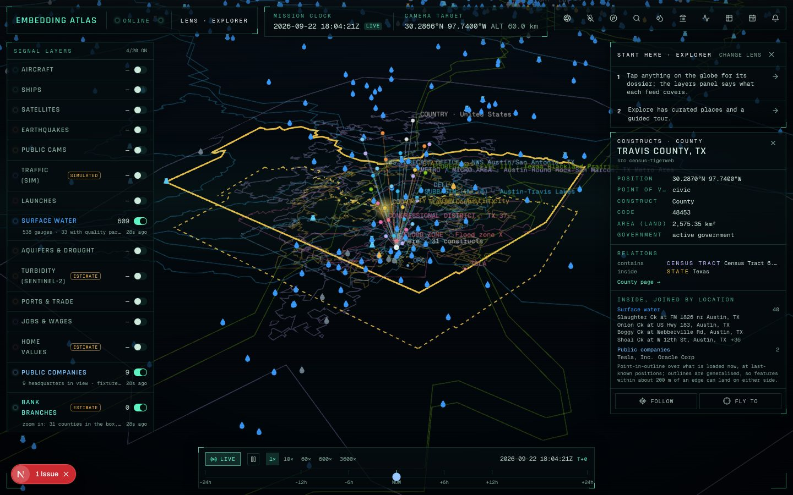
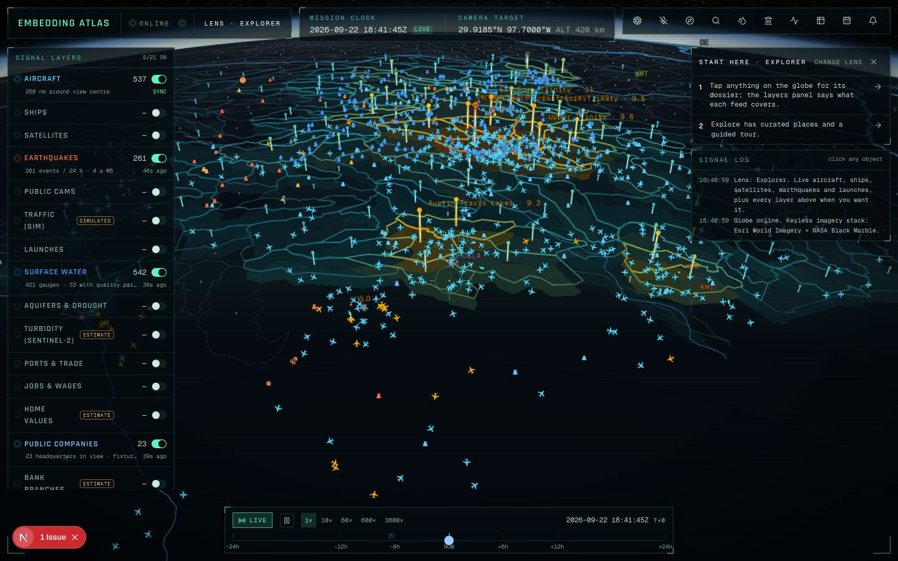
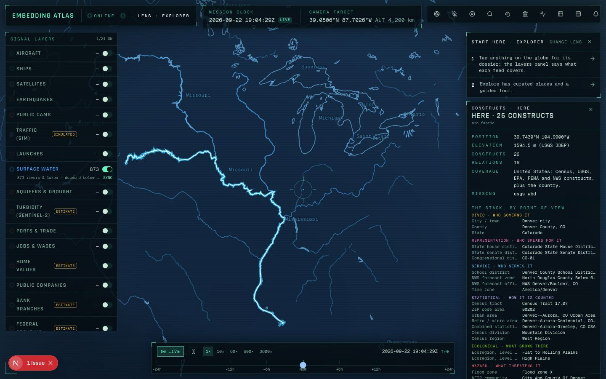
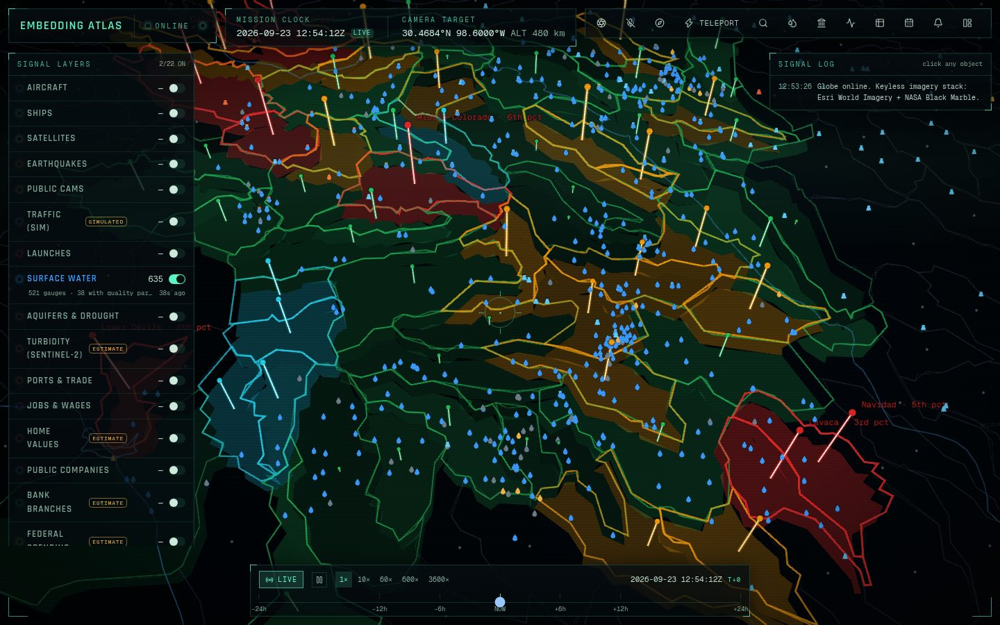
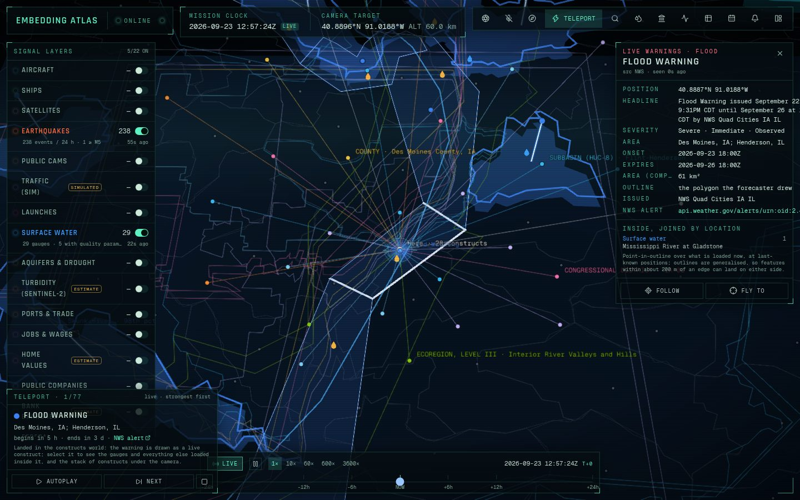

# Embedding Atlas

**A spy satellite simulator in your browser, except the data is real.**

A photorealistic 3D globe that fuses live public signals: every aircraft broadcasting ADS-B, ships on AIS, satellites propagated from CelesTrak elements, earthquakes as USGS reports them, open-data public cameras, upcoming rocket launches. And the thing the others don't do: **the water that keeps communities alive**. Rivers, lakes and reservoirs with their live gauges, the aquifers under them, this week's drought, and turbidity computed in your browser from the latest Sentinel-2 pass, with a community water report that shows its arithmetic. And, from the same public sources, **the economy in aggregate**: every harbour on Earth with US port volumes, every US land border crossing with monthly truck counts, countries shaded by trade with their partners drawn as arcs, and jobs, wages, home values and rents for every US county, with a market report that prints its formulas. And **hazards and land**: every current US wildfire perimeter with its containment, NASA's satellite fire hotspots, NWS warnings and GDACS disaster alerts with the severity their publishers give, FEMA flood zones, wetlands with the year they were mapped, and public and protected lands with their owners, managers and easement holders, a space-weather panel, NASA's live stream from the ISS, and tools that measure distance, area and ground elevation. Dark HUD, scanlines, cinematic camera, voice control. Starts with **zero API keys**. MIT licensed.

**Live:** https://eye.jcamd.com (also https://gods-eye-view-rust.vercel.app; deploys from `master`). One hosting caveat: OpenSky refuses Vercel's egress, so the zoomed-out aircraft view there falls back to adsb.lol around the view centre plus the military feed; run it locally or add OpenSky credentials for the full global picture.


| Community water report over San Antonio | Sentinel-2 turbidity chips on Calaveras and Braunig lakes |
| --- | --- |
|  |  |

| Night side, NASA Black Marble | Public camera dossier | Replay: ISS orbit at T−90 min | Traffic simulation |
| --- | --- | --- | --- |
|  |  |  |  |

## Water: rivers, lakes, aquifers, and what the satellite sees

Three layers and one report, all keyless, all labelled by what they are.

| Layer | What it holds | Where it comes from |
| --- | --- | --- |
| **Surface water** (on by default) | Rivers and lakes worldwide. Below 1,500 km camera altitude: every USGS stream and reservoir gauge in view with its latest flow, stage, temperature, dissolved oxygen, conductance, pH and turbidity; NWS flood category merged onto the gauge; Texas reservoirs with percent full. Each quality parameter is screened against a cited freshwater threshold and the site gets a **screening index** whose formula is printed next to it. Select a gauge for its 365-day trace and where today sits in it. | USGS Water Data API (`latest-continuous`, `daily`), NOAA NWPS, TWDB, Natural Earth 50 m |
| **Aquifers & drought** | This week's US Drought Monitor D0–D4 polygons draped on the terrain. Below 1,500 km: USGS monitoring wells with depth-to-water or water-level elevation and the **national aquifer each well taps** (Edwards, Ogallala, Floridan…). Select a well for its year of daily levels. | USGS Water Data API (`latest-daily`, `monitoring-locations`, `national-aquifer-codes`), USDM via the NDMC ArcGIS service |
| **Turbidity (Sentinel-2)** · ESTIMATE | Below 300 km over water: the browser finds the latest Sentinel-2 L2A scene on or before the mission clock (set the clock back, e.g. say "rewind 240 hours" or run `gev.run("set_time", { offset_minutes: -14400 })`, and it picks the newest scene before that time; the ±24 h slider rarely crosses a revisit), range-reads B04/B03/B08/B8A/SCL straight from the public COG bucket in a Web Worker, masks water, runs the Dogliotti (2015) semi-analytical turbidity algorithm on every water pixel and reports 640 m chips as median / p10–p90 FNU, drawn as a raster and as clickable chips. Where a USGS turbidity gauge sits inside a chip, its latest reading is shown next to the estimate, and its mean within ±2 h of the overpass when USGS still holds instantaneous values for that window, so the gap is visible. | Copernicus Sentinel-2 via Element 84 Earth Search (STAC + COGs), Dogliotti et al. 2015, USGS `continuous` |

**Community water report** (top bar → *Water*, or say "water report for San Antonio"): drought class at the camera target, capacity-weighted reservoir storage within 150 km, gauge flood status and quality within 75 km, wells and named aquifers within 75 km, satellite turbidity within 30 km, and a **supply-stress estimate** that prints its weights, its normalised terms and which terms were missing. Every line links to the feature it came from.

What the turbidity layer is and is not. It is the physics "teacher" that the TurbidityVision project (a separate, distilled LightGBM model; its explainer is the reference for the recipe below) learns from: T = A·ρw / (1 − ρw/C) with Dogliotti's published red (A 228.1, C 0.1641) and NIR (A 3078.9, C 0.2112) coefficients, blended between ρ_red 0.05 and 0.07, on the water mask SCL 6 ∪ (NDWI > 0.05 ∧ ρB08 < 0.10) minus cloud, shadow, snow and saturated classes. The distilled model's boosters are not bundled here. The numbers are estimates of a physical quantity from reflectance, not measurements, not regulatory values; the chip dossier says so, the layer tag says so, and the p10–p90 is the spread *inside* the chip, not model uncertainty.

Validation before shipping: the pipeline in `lib/water/` was run on the explainer's own Bexar County scene `S2A_14RNT_20250118_0_L2A` and reproduced its per-reservoir medians (Calaveras 4.47 vs 4.44 FNU, Braunig 4.02 vs 4.04, Mitchell Lake 15.98 vs 15.7). The same run settled the DN→reflectance question empirically: on this bucket ρ = DN/10000 passes the dark-water / land-NDVI / negative-fraction check and the STAC `offset −0.1` metadata does not (70 % negative reflectances), so the worker tries both conventions on every scene, keeps the one that passes and prints the check in the dossier.

## Trade, commerce and home values

Three more layers and a second report. Same rules: keyless, published values only, estimates labelled with their arithmetic. These three are **aggregates** by design: counties, metros, states, harbours and ports of entry.

| Layer | What it holds | Where it comes from |
| --- | --- | --- |
| **Ports & trade** | 3,807 harbours from the NGA World Port Index with size, harbour type, channel and pier depths, facilities and LOCODE (large ones from orbit, every one below 250 km). 45 of the 55 port authorities in the BTS Port Performance dataset (the ones that name a harbour city; ten river districts are left off) carry its statistics: container TEU and total tonnage by year with the national rank, imports / exports / empties, top commodities, vessel calls. Every US land port of entry with 25 months of trucks, trains, buses, personal vehicles and pedestrians (BTS Border Crossing Entry Data, latest month). Countries shaded by goods-and-services trade with GDP, exports, imports, trade share of GDP and container throughput from the World Bank; select a country and its top export markets and import sources arrive as arcs from WITS TradeStats. | NGA Pub 150 (bundled snapshot, `scripts/economy-data.mjs` refreshes it), data.bts.gov, World Bank WDI + WITS, Natural Earth 110 m |
| **Jobs & wages** | Every county (states above 2,500 km): establishments, third-month employment, total quarterly wages and the average weekly wage from the BLS Quarterly Census of Employment and Wages for the newest quarter published, with BLS's own over-the-year changes. Glyphs colour by the jobs change; select a county for its private-sector NAICS mix with location quotients. Cells BLS withholds stay blank. | BLS QCEW open-data CSV (`industry/10` for every area, `area/<fips>` on selection), Census TIGERweb generalized polygons |
| **Home values** · ESTIMATE | Every county Zillow models (about 3,070) filled by the one-year change in the typical home value, with the five-year change, the typical rent where ZORI covers it (about 1,390 counties), price-to-rent, and on selection a ten-year trace against the national value plus a **mortgage-against-wages** line: principal and interest on the typical home at this week's Freddie Mac rate, as a share of one average job's pay in that county, with the formula printed. | Zillow Research ZHVI and ZORI public CSVs (data through Zillow), FRED `MORTGAGE30US`, Census TIGERweb |

**Market report** (top bar → *Market*, or say "market report for Austin"): the county under the camera target with its home value and rent changes against the metro and the nation, the affordability estimate, jobs and wages with the sectors concentrated there, the ports and border crossings within 200–250 km ranked by volume, a national pulse from FRED and the BTS supply-chain indicators (mortgage rate, unemployment, retail sales, trade balance, housing starts, Case-Shiller, containerized imports, Shanghai→LA box rate, ships waiting for a berth, diesel), and a **momentum index**: a weighted mean of the published one-year changes in home values, rents, jobs and wages, each clipped to a stated scale, weights printed, missing terms listed. It is an index of published changes, not a forecast and not advice.

Where the numbers come from and what was checked before shipping: the Census Bureau's data API now requires a key, so nothing here uses it; county geometry comes from TIGERweb's generalized services, which answered a Texas-sized box (429 counties at 1:20M) in about half a second. BLS QCEW answered 2026 Q1 for all 3,275 county totals with no suppressed county totals (sector cells can be). Zillow's county file carried a July 2026 value for all 3,071 counties and a five-year comparison for 3,020. BTS port authorities were placed by matching their harbour city to a World Port Index entry within 150 km of the geocoded city; the four with no WPI entry (Palm Beach district, Pittsburgh, South Louisiana, St. Louis) sit at the city and say so in the dossier; ten river districts that name no city are left off. WITS's newest bilateral year was 2023 at the time of writing, and the arcs say which year they are.

## Hazards & land

Six more layers, a panel and three tools. Same rules: keyless, each value as its publisher sent it, and every severity in the publisher's own words. A source that rates nothing (EONET volcanoes, an NWS alert marked "Unknown", FEMA zone D) is drawn in its own "not rated" violet and says so; it is never drawn as calm.

| Layer | What it holds | Where it comes from |
| --- | --- | --- |
| **Wildfires (US)** | Every current US wildland fire in the interagency system: perimeters with acres, percent contained, discovery date and **how old the perimeter is**, counted from the time WFIGS says the perimeter was captured (about a quarter of current perimeters publish no capture time; those say so rather than borrow the record's edit time, which can run weeks later), and the incident point for fires with no perimeter yet. The "current" services keep a fire until it is declared contained, controlled or out, so a 100 %-contained fire can still show; containment is on every feature and a fire that reports none says "not reported", never 0. Prescribed fires are violet. | NIFC WFIGS Current Interagency Fire Perimeters + Current Wildland Fire Incident Locations (IRWIN) |
| **Active fires** | Every thermal hotspot NASA's satellites saw in the last 24 hours, worldwide: VIIRS 375 m (Suomi NPP, NOAA-20) and MODIS 1 km (Terra, Aqua), with fire radiative power and acquisition time. The server reads the three 24 h files (about 19 MB) every 30 minutes and cuts them to the view; above 5,000 in a view they are binned and each cell shows its brightest detection with the count it stands for; the field, the strata rail and a construct's "inside" list count a cell as those detections, not as one. **Confidence stays on each instrument's scale** (VIIRS low / nominal / high, MODIS 0–100 %). A hotspot is a hot pixel, not a confirmed fire. | NASA LANCE FIRMS global 24 h CSVs |
| **Hazard alerts** | Active NWS watches, warnings and advisories with severity, urgency and certainty; every event GDACS marks current worldwide (cyclones, floods, droughts, volcanoes, wildfires, earthquakes) with GDACS's Green / Orange / Red level, Orange and Red labelled on the globe; NASA EONET open volcano events. An NWS alert is drawn as the polygon NWS published, or else as the counties its SAME codes list (and says so); marine and zone-only alerts with no county are counted in the layer note, not drawn. GDACS's RSS feed is the list (it carries every event type and says which are current; ended ones are left out), merged with GDACS's latest-100 list and a search for current Orange and Red events, so the highest-rated can never fall off a capped list; the note says "GDACS list may be incomplete" when it might be. Two other layers draw some of the same events, and this one steps aside only while they are on and drawing the event themselves: a GDACS quake that the USGS 24 h feed also has (within 100 km and 30 min) is left to the Earthquakes layer, and only when GDACS rates it Green (Orange, Red and unrated quakes always stay); an NWS alert rated Severe or Extreme is left to **Live warnings** (the constructs layer below, whose feed asks NWS for exactly those) only when that feed outlined it (the server marks it `liveOutlined`) and Live warnings holds it on the map right now. An alert Live warnings could not outline (its zone lookups are capped), a live feed that failed, and a Live warnings layer that is erroring or still loading all leave the alert here, so a warning is never hidden from both layers. Moderate, Minor and unrated NWS alerts always stay here, and with both layers off every event is drawn here; the layer note counts what was left to whom and what stayed, and why. Toggling either layer re-sorts what is already loaded, without a refetch. Each source gets 20 s; a slow one is left out of that answer (and named) rather than holding up the rest. | NWS `alerts/active`, GDACS RSS + `geteventlist/EVENTS4APP` + `geteventlist/SEARCH`, NASA EONET v3, Census TIGERweb 1:20M counties, USGS `all_day` (the Earthquakes layer's own feed) for the quake check |
| **Flood zones (FEMA)** · regulatory map | Below 5 km: FEMA flood hazard zones (AE, A, AO, VE, X…) with FEMA's own meaning of each, whether the ground is in the special flood hazard area, and the **base flood elevation** where FEMA published one (the −9999 "none" sentinel is dropped, not shown). Zones load for a box of about 9 km around the view, drawn as a **dashed outline**: outside it nothing is loaded, which is not the same as "no flood zone". A regulatory map of the 1 % annual-chance floodplain, **not a forecast**; the Surface water layer's NWS flood categories are the "is it flooding now" answer. | FEMA National Flood Hazard Layer, MapServer layer 28 |
| **Wetlands** | Below 10 km: wetland and deep-water polygons with their Cowardin code (e.g. PEM1A), plain type, system, class, water regime and acres, coloured like the NWI Wetlands Mapper, inside the same dashed box as flood zones. **Every polygon says when it was mapped**: the year, date, scale and type of the imagery its NWI mapping project was drawn from, which can be decades old (around Mitchell Lake, 1983 colour-infrared at 1:58,000), with USFWS's own caveat that "wetlands or other mapped features may have changed since the date of the imagery and/or field work". A habitat inventory from imagery, not a jurisdictional delineation. | USFWS National Wetlands Inventory, Wetlands and Data_Source map services |
| **Public lands** | Below 250 km: fee lands filled by **public access** (open, restricted, closed, unknown); easements, designations and proclamation boundaries outlined (an easement's owner keeps the land and the holder has the rights the easement grants; the land inside a proclamation boundary is not all public). **Ownership as PAD-US publishes it**: owner and owner type, local owner, manager and manager type, and for easements the holder and holder type, with designation, GAP status, IUCN category and acres. Coded values are decoded with the service's own domains; the easement holder type has no domain on this service, so its published code is shown with the agency-type label beside it. Zoomed out past 60 km, the 600 largest units in the 2° box are kept, generalised to about 250 m, and parts of a unit outside the box or smaller than that are not drawn (the dossier says how many); the note says when units were left out. | USGS Gap Analysis Project, PAD-US 4.1 Manager Name service |

**Space weather** (top bar → sun, or the *Space* chip on a phone): the planetary Kp index for the last three days from GFZ Potsdam, recent values labelled **preliminary** as GFZ marks them, with NOAA's G-scale level when Kp reaches 5; solar flares of the last seven days and space-weather notifications of the last three from NASA's DONKI, "none reported" when the list is empty, and DONKI's own disclaimer that NOAA SWPC is the official source for forecasts.

**ISS live stream**: select the ISS (satellites layer) and its dossier embeds NASA's own stream from the station. The server asks YouTube's official oEmbed endpoint about one stream id, NASA's "Live Video from the International Space Station (Official NASA Stream)", every 30 minutes: it must be embeddable, on NASA's own channel (`https://www.youtube.com/@NASA`; display names are not unique) and titled as the Space Station stream. If any check fails the block is not shown and `/api/space?op=iss-stream` says why (the page's CSP allows exactly one frame host, `https://www.youtube-nocookie.com`); when NASA replaces the stream, the id in `lib/space/sources.ts` is updated by hand. No YouTube page is fetched: YouTube's Terms of Service bar automated access other than by search engines. The player is 200 px tall, YouTube's minimum embedded viewport, does not autoplay and has nothing drawn over it.

**Measure** (top bar → ruler, or the *Measure* chip on a phone): click the globe to lay out a path (geodesic length on the WGS84 ellipsoid) or an area (area on the equal-area authalic sphere, Rq = 6,371,007.2 m, perimeter as geodesics), with the formula printed under the readout; or click the ground for its elevation from USGS 3DEP with the source DEM's resolution. The drawn shape travels in share links. `Esc` leaves the tool and keeps the shape. While a tool is on, clicks place points instead of selecting, and a shift-click or long-press is a measure click, not a compare pin.

What was checked before shipping (2026-09-25): WFIGS answered with 167 perimeters and 460 incident points; FIRMS's NOAA-20 file held 102,124 detections; NWS had 545 active alerts, of which 64 carried a polygon; the batch zone endpoint returns zones without geometry, which is why the county fallback exists. FEMA resets a share of connections, so its route retries; each land box is cached for a day.

Re-checked 2026-09-26: GDACS's RSS feed listed 280 events, 226 of them current, while EVENTS4APP stops at the latest 100; the merged list held 243 current events, the only current Orange one being tropical cyclone ONE-26 (five Orange droughts and an Orange flood in the feed had ended, and GDACS marks them not current). 39 of 162 current WFIGS perimeters published no capture time. FEMA's layer 28 answered 243 zones for the downtown San Antonio box the preset loads, one with a published base flood elevation (634.5 ft NAVD88); the NWI answered 395 polygons around Mitchell Lake, 394 of them in two projects mapped from March 1983 colour-infrared imagery at 1:58,000; PAD-US answered 1,402 areas around Government Canyon State Natural Area (12,344 acres, open access, GAP 2), 742 of them easements. A 2° Front Range box (Denver and Boulder) is 1.3 MB and the Bay Area 0.9 MB after the 600-unit cap and part trimming; before them the Front Range was 4.8 MB, over the 4.5 MB Vercel allows a function response.

## Constructs: the world laid over the world

The layers above show the physical world. **Constructs** shows the frames laid over it, and ties every point of view together through the one thing they share: location. Switch it on and the camera target grows a tethered spiral of the constructs it sits inside, smallest nearest the ground. In downtown Austin that is 31 of them: flood zone, tract, ZIP code area, state house district, subwatershed, school district, city, county, NWS zone and office, subbasin, ecoregions, metro area, congressional district, basins up to the Texas-Gulf water region, state, census division and region, EPA and FEMA regions, Federal Reserve district, time zone, country. Each is coloured by the question it answers (who governs it, who speaks for it, who serves it, how it is counted, where its water goes, what grows there, what threatens it, which federal office answers for it). Select one and its outline floats at its height over a dashed footprint on the ground, and the panel **joins it to everything loaded on the globe inside it**: the gauges in a watershed, the companies in a congressional district, the wells in a county. Select any gauge, well, company or aircraft and the panel lists the constructs it sits in.



**Emergence.** A construct has no sensors of its own, so its state comes from the physical twin. *Construct field* tiles the whole view with one point of view's constructs and floats them as a plate above the globe. Which kind emerges depends on the zoom: water regions from orbit give way to subwatersheds over a county, states to counties to cities, congressional to state house districts. Each unit's column of light and colour rise with the physical signals loaded inside it (gauges, aircraft, ships, earthquakes, company headquarters, bank offices), recomputed every few seconds. Switch the heat to **streamflow vs normal** and the field shows what its rivers are *doing* rather than where the instruments are: every gauge's latest flow is placed among the USGS daily-mean percentiles for today's date, and each watershed takes the median of its gauges, coloured in the WaterWatch classes from much below normal (red) through normal (green) to much above (blue), its column rising with the distance from normal either way. **Where the water goes** walks the USGS drainage links from any point to the ocean and draws the path, then joins every gauge and well along it (downtown Austin reaches Matagorda Bay in 29 subwatersheds). **What drains here** reads the same links backwards: the whole catchment of a point as the smallest set of whole watersheds (downtown Austin: 832 subwatersheds, 90,411 km², drawn as 16 subbasins, 38 watersheds and 78 subwatersheds), then reads the gauges inside it near the outlet against normal for the day, so you see what is coming down the river toward you. **Live warnings** are the constructs that are born and die: every NWS alert rated Severe or Extreme, drawn as the area the forecaster drew (or the zones they named), breathing while it is in force and fading as it expires; select one to join it to the gauges and everything else inside it. **Teleport** (top bar, or say "teleport") flies to wherever the world is doing something unusual right now, NWS warnings and M4.5+ earthquakes in the order the agencies rate them, and lands in the constructs world with the right layers on; autoplay tours them. The *Civic & planning* lens (`?lens=civic`) opens on all of it.

| Construct field: Texas subbasins lit by the gauges, aircraft and companies inside them | Where the water goes: Denver to the Gulf through 217 subwatersheds |
| --- | --- |
|  |  |
| **Streamflow vs normal:** Texas watersheds coloured by where their gauges' flow sits among today's USGS percentiles (red much below, green normal, blue much above) | **Teleport:** landed on a live NWS flood warning on the Mississippi, the warning selected as a construct and joined to the gauge inside it |
|  |  |

Relations are only those the unit systems define (GEOID and HUC nesting, OMB metro delineation) or an agency publishes (NWS zone to office, state to federal region, WBD downstream HUC). An upstream that fails is named as missing, never treated as absent. `/api/fabric` serves the stack (`op=stack`, JSON or CSV), the field (`op=field`) and the trace (`op=downstream`, `op=outlines`) and the catchment (`op=upstream`, `op=units`); `/api/water?op=normals` serves the daily flow percentiles and `/api/live` the warnings and earthquakes, as do the MCP tools `place_fabric`, `place_compare`, `construct_field`, `downstream`, `upstream`, `flow_normals` and `live_events`. Sources are Census TIGERweb, USGS WBD and 3DEP, EPA ecoregions, FEMA NFHL, NWS and Natural Earth, all keyless. The design, the guarantees and the roadmap are in [`docs/CONSTRUCTS.md`](docs/CONSTRUCTS.md).

## Lenses: who is looking

The first visit asks one question, *Who is looking?*, and the answer sets the layers, the landing view, the first panel and the order of the phone nav. Every layer stays one tap away; change lens any time from the aperture button (top bar on desktop, first chip on a phone), a permalink (`?lens=water`), or by voice ("I'm a hydrologist", "switch lens to trader"). A lens is one object in `lib/personas/registry.ts`, so adding one is a data change.

| Lens | Who | Turns on | Lands on | Opens |
| --- | --- | --- | --- | --- |
| Real estate | Agents, investors, appraisers, relocation | Home values, jobs & wages, surface water | Austin housing | Market report; screener preset on momentum |
| Economist | Macro, regional and labour economists, journalists | Jobs & wages, ports & trade, home values | The United States | Signals (all categories), releases next |
| Trader | Equity, commodity and macro traders | Public companies, ports & trade, ships, aircraft | Los Angeles and Long Beach | Signals (freight); screener on ports losing TEU |
| Water & ecology | Biologists, hydrologists, utilities, conservation | Surface water, aquifers & drought, turbidity | Calaveras and Braunig lakes | Water report; signals (water) |
| Supply chain | Logistics, shipping, freight and trade operations | Ports & trade, ships, aircraft | The Laredo crossings | Signals (freight); screener on crossings by trucks |
| Public finance | Bankers, municipal analysts, grant writers, local government | Bank branches, federal spending, jobs & wages, surface water | Travis County | Market report; signals (labour) |
| Civic & planning | Planners, local government, journalists, civic technologists | Constructs, construct field, live warnings, surface water, public companies, banks, earthquakes | Downtown Austin | Layers (the field controls) |
| Explorer | Everyone else | Aircraft, ships, satellites, earthquakes, launches, surface water | Orbit | Nothing; the classic spy-satellite view |

Each lens shows a **Start here** card with three first steps that open the right panel when tapped; dismiss it once and it stays dismissed for that lens. On phones the heavy live layers (aircraft, satellites) stay off until you switch them on. Explore lists the lens's curated places first.

## For practitioners: history, screens, signals, releases, watchlists, desk mode

The globe is the front door; the rest of this section is for analysts, economists and traders who need the same public numbers as time series, tables and feeds. Every route below is keyless, CORS-open, returns a provenance envelope (`data`, `provenance[]`, `generatedAt`, `caveats[]`), answers `format=csv` where the payload is tabular, and is described at [`/api/openapi`](https://eye.jcamd.com/api/openapi). The practitioner guide is [`docs/API.md`](docs/API.md).

| What | Where | Notes |
| --- | --- | --- |
| **Nowcast series from the live feeds** | `/api/series`, [`docs/SNAPSHOTS.md`](docs/SNAPSHOTS.md) | A GitHub Actions cron samples the feeds every three hours and commits counts to `data/series/`: vessels within reach of 54 major ports (all, stationary, moving), aircraft over 19 cargo hubs (all, cargo carriers), eight river gauges, Texas reservoir storage, daily earthquake counts. Counts only, never an MMSI or a hex code. Read with `op=get&id=snapshot:port-vessels-stationary:USLAX&rollup=daily-mean`. |
| **Backfilled indices** | `/api/economy/history`, [`docs/HISTORY.md`](docs/HISTORY.md) | Ten years of monthly ZHVI and ZORI, quarterly QCEW jobs, wages and establishments, the weekly Freddie Mac rate, and the momentum and affordability indices computed for every month, per county or nationally. `op=ic&h=12` runs a cross-sectional information-coefficient test of the home-only momentum signal against the next twelve months of home-value change. Descriptive, not a forecast. |
| **Screener** | `/api/screen`, [`docs/SCREENER.md`](docs/SCREENER.md), top bar → *Screen* | Rank and filter every county, state, harbour, land crossing or country: `kind=county&q=home.yoyPct>5 AND jobs.yoy.emp<0 SORT momentum DESC LIMIT 50`. Percentile ranks with `pct=1`, a field registry with `fields=1`, six presets in the panel, click a row to fly there, `?screen=county:<query>` shares one. |
| **Named indicators** | `/api/indicators`, [`docs/INDICATORS.md`](docs/INDICATORS.md), top bar → *Signals* | Nineteen signals with thresholds and a why-it-matters line: Mississippi at Memphis and St. Louis, Ohio at Louisville, Missouri at St. Joseph, Hoover releases, Texas reservoirs, Laredo trucks, LA + Long Beach TEU, ships waiting for a berth, the Shanghai–LA box rate, diesel, WTI, the 30-year mortgage rate, starts, permits, Case-Shiller, unemployment (Sahm-style), the trade balance, retail sales. Levels marked *convention* are ours, not official. |
| **Release calendar, vintages, movers** | `/api/releases`, [`docs/RELEASES.md`](docs/RELEASES.md), top bar → *Releases* | When each table changes (official schedules where they exist, windows where they do not), which release of each table is loaded now, and the biggest movers since the previous release for home values, jobs, border trucks and port TEU. Permalinks accept `&v=YYYY-MM-DD` to pin a vintage; the HUD shows `VINTAGE`. |
| **Watchlists and alerts** | `/api/watch`, [`docs/WATCHLISTS.md`](docs/WATCHLISTS.md), top bar → *Watch* | Counties, ports, crossings, gauges, series, indicators or companies with rules (`home.yoyPct >= 3`, `stage crosses_above 8`, `value changes_by_pct -10 over 7d`) as RSS, Atom, JSON Feed or JSON. The token in the URL is the list itself, so the server keeps nothing; treat the URL as a secret. With `GEV_CRON_SECRET` set, fired rules go to an https webhook signed with `X-GEV-Signature`. |
| **Place fabric** | `/api/fabric`, [`docs/CONSTRUCTS.md`](docs/CONSTRUCTS.md) | Every construct a point sits inside (civic, representation, service, statistical, hydrologic, ecological, hazard, federal) with the relations the unit systems define: `op=stack&lon=-97.74&lat=30.27`, `&geometry=1` for outlines, `&format=csv`; two places side by side with `op=compare&lon=…&lat=…&lon2=…&lat2=…`. |
| **MCP server, Python client, notebook** | `/api/mcp`, [`docs/MCP.md`](docs/MCP.md), [`examples/`](examples/) | `claude mcp add --transport http gev https://eye.jcamd.com/api/mcp` (or `claude mcp add gev -- node scripts/mcp-stdio.mjs` locally): 30 read-only tools, the docs and OpenAPI document as resources, three prompts (county due diligence, port congestion check, water stress brief). `examples/gev.py` is a dependency-free client; the notebook walks Texas counties into pandas. |
| **Desk mode** | `?mode=desk` or press `D`, [`docs/DESK.md`](docs/DESK.md) | A light, dense analyst workspace: the globe on the left, a resizable pane with a sortable table of every loaded feature (CSV, TSV to clipboard), a multi-series chart fed by the series store, indicators and county history (dual axes, normalise to 100, PNG/CSV), the two reports as printable documents, and notes that copy out as markdown with a permalink and citations. Scanlines and drift are off while it is on. |

**Public companies, banks and federal dollars.** Three more layers from regulators' own APIs, all keyless and public domain: every listed company in SEC EDGAR at its registered business address (filings, XBRL revenue, income, assets, equity, cash and debt with their periods, ratios that print their formulas, a sector-to-ETF bridge stated as a convention; `/api/companies`, [`docs/COMPANIES.md`](docs/COMPANIES.md)); every FDIC-insured office with Summary of Deposits, a county's deposit market with the top banks and an HHI, quarterly ROA, ROE and noncurrent loans per institution, bank failures by year; and USAspending obligations by county and award family for the latest complete fiscal year with dollars per covered job, top recipients, awarding agencies and NAICS mix (`/api/finance`, [`docs/FINANCE.md`](docs/FINANCE.md)). Company-level and institution-level only: no officers, insiders or shareholders. The market report lists the companies headquartered in the county, its jobs mix folded into GICS sectors, and where the finance section is wired, its deposit market and federal dollars. The companies layer ships with a 25-company fixture; `node scripts/companies-data.mjs` builds the full bundle from EDGAR (about 6,000 filers at the SEC's 8 requests per second).

## Explore it

Every view is a link. **Share** in the top bar copies one that carries the camera target, the layers, the mission clock and the selected object; **Explore** opens curated places, a guided tour, and exports.

| Start here | What loads |
| --- | --- |
| [Calaveras & Braunig, San Antonio](https://eye.jcamd.com/?lat=29.28&lon=-98.34&h=60000&layers=water,turbidity,groundwater&report=1) | Sentinel-2 turbidity chips beside USGS turbidity gauges, with the community water report open |
| [Edwards Aquifer wells](https://eye.jcamd.com/?lat=29.42&lon=-98.49&h=120000&layers=water,groundwater&report=1) | Wells named by aquifer, drought class, gauges with full quality panels |
| [Highland Lakes, Austin](https://eye.jcamd.com/?lat=30.4&lon=-97.9&h=120000&layers=water,groundwater&report=1) | TWDB reservoirs with percent full; the report weights storage by capacity |
| [Lake Mead & Hoover Dam](https://eye.jcamd.com/?lat=36.05&lon=-114.74&h=150000&layers=water,turbidity,groundwater) | Dozens of turbidity and oxygen gauges plus satellite chips |
| [Chesapeake Bay](https://eye.jcamd.com/?lat=38.95&lon=-76.45&h=120000&layers=water,turbidity) | Estuary turbidity, gauges on the tributaries |
| [Western Lake Erie](https://eye.jcamd.com/?lat=41.7&lon=-83.4&h=150000&layers=water,turbidity,groundwater) | Open-water chips, Maumee gauges, inland wells |
| [Lake Okeechobee](https://eye.jcamd.com/?lat=26.95&lon=-80.8&h=150000&layers=water,turbidity,groundwater) | Canal gauges, basin wells, lake chips |
| [Mississippi & Atchafalaya](https://eye.jcamd.com/?lat=30&lon=-91.3&h=200000&layers=water,groundwater) | NWS flood categories along the lower river |
| [Rio Grande at El Paso](https://eye.jcamd.com/?lat=31.75&lon=-106.5&h=120000&layers=groundwater,water&report=1) | A groundwater story: wells, aquifers, drought |
| [The planet's water](https://eye.jcamd.com/?lat=30&lon=-97.7&h=12000000&layers=water,groundwater) | Every named river and lake with this week's drought classes |
| [Who trades with whom](https://eye.jcamd.com/?lat=25&lon=-40&h=16000000&layers=trade) | Countries shaded by trade; click one for its partners as arcs |
| [Los Angeles & Long Beach](https://eye.jcamd.com/?lat=33.76&lon=-118.22&h=90000&layers=trade,commerce,realestate&market=1) | The two busiest container ports with their TEU history, and the market report |
| [Laredo crossings](https://eye.jcamd.com/?lat=27.55&lon=-99.5&h=160000&layers=trade,commerce) | The busiest truck crossing in North America, 25 months of counts |
| [Austin housing](https://eye.jcamd.com/?lat=30.3&lon=-97.75&h=160000&layers=realestate,commerce&market=1) | Counties by one-year home value change, rents, wages, the mortgage-against-wages estimate |
| [Fifty states](https://eye.jcamd.com/?lat=39&lon=-97&h=6500000&layers=realestate,commerce) | Every state by home value change with statewide jobs and wages |
| The largest fire burning now (Explore → Hazards & land; resolves at click time) | The current WFIGS perimeter with the most acres, selected, with the hotspots around it. Fires move, so this one has no fixed link |
| [Hazards worldwide](https://eye.jcamd.com/?lat=15&lon=10&h=16000000&layers=hazards,fires,earthquakes) | Every current GDACS event with its alert level (Orange and Red labelled), EONET volcanoes, 24 h of FIRMS hotspots binned from orbit |
| [San Antonio River floodplain](https://eye.jcamd.com/?lat=29.4232&lon=-98.4883&h=3000&layers=flood,water) | FEMA flood zones at street scale inside the dashed loaded box; the AE zone at the target carries a base flood elevation of 634.5 ft (NAVD88) |
| [Mitchell Lake wetlands](https://eye.jcamd.com/?lat=29.28&lon=-98.43&h=7000&layers=wetlands,water) | About 400 NWI polygons: ponds, riverine channels, emergent marsh, mapped from March 1983 colour-infrared imagery, so the ground may have changed since |
| [Government Canyon](https://eye.jcamd.com/?lat=29.5737&lon=-98.7556&h=40000&layers=publiclands,water) | A 12,344-acre state natural area among some 1,400 public and protected areas, fee lands filled by public access and easements outlined with their holders |

Link parameters: `lens` (who is looking; sets layers, panel and camera unless the link carries its own), `lat`, `lon`, `h` (camera height in metres), `hd` / `p` (heading, pitch), `layers` (comma list of layer ids, exactly these on), `t` (mission clock, ISO; omitted while live), `sel=layer:id` (selected object, best effort once its feed loads), `report=1` (water report open), `market=1` (market report open), `space=1` (space-weather panel open), `shape=a:lon,lat;lon,lat;…` or `shape=l:…` (a drawn area or line, up to 60 vertices, shown with its measurement; written last and unescaped so it stays readable), `embed=1` (no HUD chrome, for iframes; data credits stay).

Embed it:

```html
<iframe src="https://eye.jcamd.com/?lat=29.28&lon=-98.34&h=60000&layers=water,turbidity&embed=1"
        width="960" height="600" style="border:0" allow="clipboard-write" loading="lazy"></iframe>
```

Take the data with you: **Explore → Take the data with you** saves every loaded gauge reading as CSV, the turbidity chips as GeoJSON polygons with scene provenance, every loaded county or state with its home value, rent, jobs and wages as CSV, and the loaded harbours and crossings with their volumes as CSV; both reports have copy-as-text and JSON buttons in their headers.

## Use the data without the globe

`/api/water` is a keyless, CORS-open JSON API over the same public sources, edge-cached by op. Call it from a notebook, a script or your own page:

```bash
# Community water report for a point (drought, reservoirs, gauges, wells, stress estimate with its formula)
curl "https://eye.jcamd.com/api/water?op=report&lon=-98.49&lat=29.42"

# Latest USGS gauge readings in a box (flow, stage, temp, DO, conductance, pH, turbidity, reservoir level/storage)
curl "https://eye.jcamd.com/api/water?op=gauges&bbox=-98.6,29.2,-98.2,29.6"
curl "https://eye.jcamd.com/api/water?op=gauges&bbox=-98.6,29.2,-98.2,29.6&param=63680"   # turbidity only

# NWS flood categories, Texas reservoirs, USGS wells with aquifer names, this week's Drought Monitor polygons
curl "https://eye.jcamd.com/api/water?op=nwps&bbox=-98.6,29.2,-98.2,29.6"
curl "https://eye.jcamd.com/api/water?op=twdb"
curl "https://eye.jcamd.com/api/water?op=wells&bbox=-98.6,29.2,-98.2,29.6"
curl "https://eye.jcamd.com/api/water?op=drought"

# One site: 365 days of daily means, or instantaneous values in a window
curl "https://eye.jcamd.com/api/water?op=history&site=USGS-08180800&param=00060"
curl "https://eye.jcamd.com/api/water?op=matchup&site=USGS-08181500&param=63680&from=2026-09-02T15:25:56Z&to=2026-09-02T19:25:56Z"
```

`/api/economy` does the same for trade, jobs and home values:

```bash
# Market report for a point: home values vs metro and nation, rents, affordability estimate with its formula,
# jobs and sector concentration, nearest ports and crossings, national pulse, momentum index
curl "https://eye.jcamd.com/api/economy?op=report&lon=-97.75&lat=30.3"

# Counties in a box (jobs, wages, home values, rents, geometry), or every state
curl "https://eye.jcamd.com/api/economy?op=areas&bbox=-98.5,29.8,-97,31"
curl "https://eye.jcamd.com/api/economy?op=areas&level=state"

# One county's private-sector NAICS mix with location quotients; the same plus metro / state / US home values
curl "https://eye.jcamd.com/api/economy?op=sectors&fips=48453"
curl "https://eye.jcamd.com/api/economy?op=context&fips=48453"

# Harbours in a box (min=large|medium|small|all) with BTS volumes; every US land border crossing
curl "https://eye.jcamd.com/api/economy?op=ports&bbox=-96,28.5,-93.5,30.5&min=all"
curl "https://eye.jcamd.com/api/economy?op=border"

# Countries with World Bank indicators; a country's top partners; the national pulse
curl "https://eye.jcamd.com/api/economy?op=countries"
curl "https://eye.jcamd.com/api/economy?op=partners&iso3=USA"
curl "https://eye.jcamd.com/api/economy?op=pulse"
```

Every response carries `provenance` (one record per upstream release, estimates with their formula) and `generatedAt`; tabular ops answer `format=csv` with the same provenance as `#` footer lines (`pd.read_csv(url, comment="#")`). The practitioner routes (`/api/series`, `/api/economy/history`, `/api/screen`, `/api/indicators`, `/api/releases`, `/api/watch`, `/api/companies`, `/api/finance`, `/api/mcp`) follow the same envelope; see the section above and `/api/openapi`.

`/api/hazards`, `/api/land` and `/api/space` do the same for the hazards & land layers, with the same envelope and a `caveats` list that says what each answer is not (not a warning service, not a forecast, not permission to enter):

```bash
# Current US wildfire perimeters (containment, perimeter capture time) and incident points without a perimeter
curl "https://eye.jcamd.com/api/hazards?op=wildfire"

# FIRMS hotspots of the last 24 h in a box, as rows (see `columns`); binned to `max` (500-8000, default 5000)
curl "https://eye.jcamd.com/api/hazards?op=fires&bbox=-125,32,-114,42"

# NWS alerts (polygon or listed counties; those the Live warnings feed outlined carry liveOutlined), current GDACS events (quakes USGS also has carry alsoInUsgs), EONET volcanoes
curl "https://eye.jcamd.com/api/hazards?op=alerts"

# FEMA flood zones, NWI wetlands with their imagery years (boxes up to ~9 km), PAD-US public lands with owners (up to 2 degrees)
curl "https://eye.jcamd.com/api/land?op=flood&bbox=-98.50,29.41,-98.47,29.44"
curl "https://eye.jcamd.com/api/land?op=wetlands&bbox=-98.45,29.26,-98.41,29.30"
curl "https://eye.jcamd.com/api/land?op=publiclands&bbox=-99,29.3,-98.5,29.8"

# Ground elevation from USGS 3DEP (metres, with the source DEM resolution)
curl "https://eye.jcamd.com/api/land?op=elevation&lon=-98.47&lat=29.465"

# Kp (GFZ, preliminary values marked), DONKI flares and notifications; NASA's ISS stream after its oEmbed check
curl "https://eye.jcamd.com/api/space?op=weather"
curl "https://eye.jcamd.com/api/space?op=iss-stream"
```

Water boxes are clamped to 4° and snapped to a 0.5° grid, economy boxes to 18° and a 1° grid, fire boxes to a 1° grid, flood and wetland boxes to 0.08° and a 0.02° grid, public-land boxes to 2° and a 0.25° grid, so nearby callers share a cache entry. Responses carry `source`, `cacheAge` and, for the report, `globe`: the permalink that opens the same point on the globe. The report from the API has no satellite turbidity term (that runs in a browser) and says so in `caveats`. Please keep the upstreams' terms in mind; the route already rate-gates and backs off on their behalf.

## Quick start

```bash
git clone https://github.com/jcdavis131/gods-eye-view
cd gods-eye-view
npm install        # also copies Cesium's static assets into public/cesium
npm run dev        # http://localhost:3000
```

That is the whole setup. No account, no token, no `.env`. Everything below the fold works on free public endpoints.

Pinokio users: add this folder (or the repo URL) in Pinokio and press **Install**, then **Start**. `pinokio.js`, `install.js`, `start.js`, `update.js` and `reset.js` are in the repo root.

## What you get with no keys

| Layer | Source (no key) | Refresh | Notes |
| --- | --- | --- | --- |
| Aircraft | [adsb.lol](https://adsb.lol) point query (≤ 250 nm around the view) + its global military-flagged feed; [OpenSky](https://opensky-network.org) when zoomed out | 10 s | Positions are dead-reckoned between reports for up to 90 s. OpenSky anonymous quota is 400 credits/day; the server caches 90 s and the HUD shows credits left. |
| Ships | [Digitraffic](https://www.digitraffic.fi/en/marine-traffic/) (Fintraffic) AIS | 20 s | Real AIS, **Baltic Sea coverage**. No mock ships anywhere; the layer says what it covers. |
| Satellites | [CelesTrak](https://celestrak.org) GP elements, SGP4 via satellite.js | 2 h | Fully time-scrubbable. Propagation runs in a Web Worker, so the ~11k "all active" group (opt-in) stays smooth. Default groups: stations, brightest, GPS, military, weather. |
| Earthquakes | [USGS](https://earthquake.usgs.gov) all-magnitudes, past 24 h | 60 s | Sized and coloured by magnitude. |
| Public cams | [TfL JamCams](https://api-portal.tfl.gov.uk) + [NYC DOT](https://webcams.nyctmc.org) | 5 min | Open-data traffic cameras with live stills in the info panel. Positions only. |
| Traffic (sim) | OpenStreetMap roads via Overpass; vehicles are **simulated** | 10 min | Labelled SIMULATED everywhere. See [Ethics](#ethics-guardrails). Activates below 30 km camera altitude. |
| Launches | [Launch Library 2](https://thespacedevs.com) upcoming + recent | 15 min | Pads, countdowns, a coarse estimated ascent arc, an animated vehicle for T+0 to T+10 min. |
| Surface water | [USGS Water Data API](https://api.waterdata.usgs.gov) + [NOAA NWPS](https://api.water.noaa.gov) + [TWDB](https://www.waterdatafortexas.org/reservoirs) + Natural Earth | 5 min | Rivers/lakes always; gauges, flood status and reservoirs below 1,500 km. Quality screening against EPA freshwater criteria with the formula shown. |
| Aquifers & drought | USGS wells + aquifer codes, [US Drought Monitor](https://droughtmonitor.unl.edu) | 30 min | Drought polygons always; wells below 1,500 km. Depth-to-water reads inverted (deeper is drier) and says so. |
| Turbidity (Sentinel-2) | [Earth Search](https://earth-search.aws.element84.com/v1) STAC + `sentinel-cogs` bucket, computed in-browser | 1 h / per scene | ESTIMATE. Dogliotti 2015 physics on the latest low-cloud scene before the mission clock; 640 m chips with in-situ USGS matchups. Activates below 300 km. |
| Ports & trade | [NGA World Port Index](https://msi.nga.mil/Publications/WPI) (bundled), [BTS](https://data.bts.gov) port performance + border crossings, [World Bank WDI](https://data.worldbank.org) + [WITS](https://wits.worldbank.org), Natural Earth | 1 h | Harbours by size as you descend; every land crossing below 6,000 km; countries always. Partner arcs on selection. |
| Jobs & wages | [BLS QCEW](https://www.bls.gov/cew/) open-data CSVs, Census TIGERweb | 1 h | Newest quarter published; withheld cells stay blank. Sector mix with location quotients on selection. |
| Home values | [Zillow Research](https://www.zillow.com/research/data/) ZHVI + ZORI (data through Zillow), FRED mortgage rate | 6 h | ESTIMATE. County and state aggregates. Ten-year trace and mortgage-against-wages line on selection. |
| Public companies | [SEC EDGAR](https://www.sec.gov/search-filings/edgar-application-programming-interfaces) tickers, submissions, XBRL company facts and frames (bundled snapshot), Census ZCTA-to-county file, TIGERweb | 6 h / 12 h on selection | HQ points below 3,000 km coloured by sector, labelled by ticker. Filings and annual facts on selection. No insiders. |
| Banks | [FDIC BankFind Suite](https://banks.data.fdic.gov/docs/) institutions, locations, Summary of Deposits, financials | 6 h | Every insured office below 300 km with deposits per office; county deposit market and HHI (ESTIMATE, formula printed) on selection. |
| Federal spending | [USAspending](https://api.usaspending.gov/) spending by geography, category and over time | 12 h | Counties below 2,500 km, states above, coloured by obligations per covered job (ESTIMATE). Recipients, agencies, NAICS and a six-year trace on selection. |
| Construct field | Census TIGERweb, USGS WBD, EPA ecoregions; [USGS Water Data Statistics API](https://api.waterdata.usgs.gov/statistics/v0/) for the streamflow condition | 24 h per view box; percentiles 30 days per site-day | One point of view's constructs across the view, the kind chosen by zoom; heat recomputed in the browser from the physical layers loaded inside each, or from the gauges' flow against the day's published percentiles. ESTIMATE. |
| Live warnings | [api.weather.gov](https://www.weather.gov/documentation/services-web-api) active alerts (Severe and Extreme) | 5 min | Each alert as a short-lived hazard construct: the forecaster's polygon or its zones, from onset to expiry; select one to join what is loaded inside it. Teleport tours them with the day's M4.5+ USGS earthquakes. |
| Constructs | [Census TIGERweb](https://tigerweb.geo.census.gov/), [USGS WBD](https://www.usgs.gov/national-hydrography/watershed-boundary-dataset) + 3DEP, [EPA ecoregions](https://www.epa.gov/eco-research/ecoregions), [FEMA NFHL](https://www.fema.gov/flood-maps/national-flood-hazard-layer), [api.weather.gov](https://www.weather.gov/documentation/services-web-api), Natural Earth | 6 h per point | Every construct at the camera target as floating strata; select one to join loaded features inside it. Full stack in the US, the country elsewhere. |
| Wildfires (US) | [NIFC WFIGS](https://data-nifc.opendata.arcgis.com/) current perimeters + incident locations | 5 min | Containment and perimeter age (from the capture time; "unknown" where WFIGS has none) on every fire; "not reported" when containment is missing. NIFC: not legal documents. |
| Active fires | [NASA LANCE FIRMS](https://firms.modaps.eosdis.nasa.gov/) 24 h CSVs (VIIRS S-NPP, VIIRS NOAA-20, MODIS) | 15 min | Worldwide. Confidence on each instrument's own scale. Binned by brightest detection above 5,000 per view. |
| Hazard alerts | [NWS](https://www.weather.gov/documentation/services-web-api) `alerts/active`, [GDACS](https://www.gdacs.org), [NASA EONET](https://eonet.gsfc.nasa.gov) volcanoes, TIGERweb counties | 3 min | Severities as published; unrated is shown as unrated. Only events GDACS marks current. Green GDACS quakes that USGS also has are left to Earthquakes, and Severe/Extreme NWS alerts to Live warnings, only while those layers are on and drawing them. |
| Flood zones (FEMA) | [FEMA NFHL](https://hazards.fema.gov/femaportal/wps/portal/NFHLWMS) layer 28 | 6 h (1 day server cache) | Below 5 km, inside a dashed loaded box. Regulatory map, not a forecast. Base flood elevation only where FEMA published one. |
| Wetlands | [USFWS National Wetlands Inventory](https://www.fws.gov/program/national-wetlands-inventory) | 6 h (1 day server cache) | Below 10 km. Cowardin code, type, water regime, acres, and the year of the imagery each polygon was mapped from. |
| Public lands | [USGS PAD-US 4.1](https://www.usgs.gov/programs/gap-analysis-project/science/pad-us-data-overview) | 12 h (1 day server cache) | Below 250 km. Fee lands by public access; easements outlined; owners, managers and easement holders as published; largest 600 units when zoomed out. |
| Space weather (panel) | [GFZ Potsdam Kp](https://kp.gfz.de) (CC BY 4.0) + [NASA DONKI](https://kauai.ccmc.gsfc.nasa.gov/DONKI/) | 15 min | Preliminary Kp labelled; "none reported" when DONKI lists nothing. |
| ISS live stream (dossier) | YouTube oEmbed for NASA's ISS stream id | 30 min | Shown only when the stream is embeddable, on NASA's channel and titled as the Space Station stream. |
| Elevation (Measure) | [USGS 3DEP EPQS](https://epqs.nationalmap.gov/v1/docs) | per click (1 day cache) | United States; the service's "no data" sentinel is shown as no data. |
| Globe | Esri World Imagery + NASA GIBS Black Marble night lights | — | Day/night lighting, atmosphere, fog, stars. |

## Optional keys (all entered in the app, none required)

Press **Keys** in the top bar or hit `,`. Keys live in `localStorage` and are only ever sent to this app's own `/api` routes (as request headers) or to the vendor SDK they belong to (voice).

| Key | Unlocks |
| --- | --- |
| `GOOGLE_MAPS_API_KEY` | Google Photorealistic 3D Tiles (buildings, trees, terrain). |
| `CESIUM_ION_TOKEN` | Cesium World Terrain. |
| `ADSBX_RAPIDAPI_KEY` | ADS-B Exchange as an alternative aircraft source. |
| `OPENSKY_CLIENT_ID` / `OPENSKY_CLIENT_SECRET` | 4000 OpenSky credits/day for the global view. |
| `AISSTREAM_KEY` | Global AIS via [AISStream](https://aisstream.io) websocket (free key). |
| `WINDY_WEBCAMS_KEY` | Windy public webcams worldwide, nearest 50 to the view. |
| `ELEVENLABS_AGENT_ID` (+ `ELEVENLABS_API_KEY` for private agents) | ElevenLabs Conversational AI voice agent. |
| `VAPI_PUBLIC_KEY` + `VAPI_ASSISTANT_ID` | Vapi realtime voice agent. |

## Controls

- Drag to orbit, scroll to zoom, middle-drag or ctrl-drag to tilt.
- Click any object for its dossier; **Follow** locks the camera to it (your orbit offset is kept while it moves).
- `⌘K` / `Ctrl+K` search flights, ships, satellites and cameras by callsign, name, MMSI, ICAO hex or NORAD id, or geocode a place. It matches names and published identifiers and place names only, never an owner, operator, manager or easement-holder field.
- **Explore** opens curated places, the guided tour and exports; **Share** copies a permalink to exactly this view.
- **Measure** (ruler) turns clicks into a path, an area or an elevation reading; `Esc` leaves the tool and keeps the shape, which travels in the share link. **Space** (sun) opens the space-weather panel.
- Timeline scrubs ±24 h. Satellites and launches propagate to any time. Live layers hold their last known state and are flagged `LAST KNOWN`; nothing is synthesised for the past.
- Idle for 12 s and the camera drifts in orbit (cinematic mode, toggle in settings).
- `D` toggles desk mode. Top bar: **Signals** (indicators), **Screen** (screener), **Releases** (calendar, vintages, movers), **Watch** (watchlists); the strip is icon-only with tooltips and scrolls sideways on narrow screens.
- On a phone (or a short landscape viewport) the HUD stacks: a one-row header with voice, search and settings; a bottom strip of panel toggles (Layers, Water, Market, Space, Measure, Signals, Screen, Releases, Watch, Explore, Teleport, Share); a compact timeline that unfolds on tap; and one bottom sheet that holds every open panel, with a handle to make it taller and an X that closes everything. The panel you asked for sits at the top of the sheet and the lens's Start-here card folds beneath it. Layers on a phone is a two-column grid that opens on your lens's own feeds plus anything you switched on, with the rest behind one “More layers” tap and a short list of any feed that is failing (`lib/layers/groups.ts` decides the split). Pinch and drag work on the globe as usual. The site is installable (web app manifest, standalone display, home-screen icons from `public/icon.svg`; `node scripts/icons.mjs` regenerates the PNGs), the server picks the phone layout from the request so there is no desktop flash, and phones skip the backdrop blur, scanlines and idle drift to save the GPU.
- Voice: press **Voice** and say "show me flights over Austin", "track the ISS", "rewind 30 minutes", "go live", "what am I looking at", "show me aquifers", "water report for San Antonio", "market report for Austin", "show me ports", "home values in Denver", "explore Lake Mead", "start the tour", "I'm a realtor", "switch lens to economist", "change lens", "show companies", "show banks", "show federal spending", "show me wildfires", "show flood zones over Houston", "show public lands", "show live warnings", "show constructs", "show jurisdictions", "show construct field", "where does the water go", "what drains here", "teleport", "I'm a planner", "open the screener", "screen counties where rents rising and jobs falling", "show indicators", "release calendar", "what changed", "open my watchlist", "watch this", "pin vintage 2026-08-15", "desk mode".

## Voice control

Three providers share one command registry (`lib/voice/commands.ts`):

| Provider | Needs | How |
| --- | --- | --- |
| Browser (default) | nothing | Web Speech API + a small local intent parser (`lib/voice/intent.ts`). Chrome/Edge/Safari. |
| ElevenLabs | agent id | Conversational AI agent; every command is registered as a **client tool** so the agent calls the globe directly. |
| Vapi | public key + assistant id | Web SDK call; function tools are advertised on the call as async client tools and results are posted back as system messages. |

For ElevenLabs and Vapi, configure tools on the vendor side with these names and schemas (also available at runtime as `window.atlas.commands` and `toolDefinitions()`):

```json
[
  { "name": "fly_to_place",    "parameters": { "place": "string", "altitude_km": "number?" } },
  { "name": "show_layer",      "parameters": { "layer": "aircraft|ships|satellites|earthquakes|cameras|traffic|launches|water|groundwater|turbidity|trade|commerce|realestate|companies|banks|spending|occupations|weather|wildfire|fires|hazards|flood|wetlands|publiclands|sports|constructs|field|alerts", "on": "boolean", "place": "string?" } },
  { "name": "find_object",     "parameters": { "query": "string", "follow": "boolean?" } },
  { "name": "follow_selected", "parameters": { "on": "boolean" } },
  { "name": "set_time",        "parameters": { "offset_minutes": "number?", "live": "boolean?" } },
  { "name": "home_view",       "parameters": {} },
  { "name": "water_report",    "parameters": { "place": "string?" } },
  { "name": "explore_preset",  "parameters": { "preset": "string?", "tour": "boolean?" } },
  { "name": "describe_view",   "parameters": {} },
  { "name": "open_panel",      "parameters": { "panel": "screener|indicators|releases|movers|watchlist|desk|hud", "on": "boolean?" } },
  { "name": "screen",          "parameters": { "kind": "county|state|port|crossing|country", "query": "string" } },
  { "name": "watch_selected",  "parameters": {} },
  { "name": "set_vintage",     "parameters": { "date": "string?" } },
  { "name": "set_lens",        "parameters": { "lens": "realestate|economist|trader|water|logistics|banking|explorer" } }
]
```

Vapi tools must be marked `async: true` (the browser executes them; there is no server webhook).

## Architecture

```
 browser ─────────────────────────────────────────────────────────────────────────────┐
 │                                                                                    │
 │  components/hud/*          HUD: layer panel, info panel, timeline, search, voice   │
 │        │  zustand (lib/store)                                                      │
 │        ▼                                                                           │
 │  components/globe/LayerHost.tsx   one tanstack-query per enabled layer             │
 │        │  fetch() → GeoJSON FeatureCollection                                      │
 │        ▼                                                                           │
 │  lib/layers/<name>.ts     normalise upstream JSON → GeoJSON (pure, inspectable)    │
 │        │                                                                           │
 │        ▼                                                                           │
 │  lib/globe/renderer.ts    LayerRenderer: billboards / points / polylines / labels /│
 │                           ground polygons / raster overlay                         │
 │  lib/water/*              Dogliotti physics, UTM, quality screening, water report; │
 │                           turbidity.worker.ts reads Sentinel-2 COGs in a Worker    │
 │  lib/globe/styles.ts      glyph, colour, label, position-at-time per layer         │
 │        │                                                                           │
 │        ▼                                                                           │
 │  components/globe/CesiumGlobe.tsx   CesiumJS viewer, imagery, picking, follow,     │
 │                                     cinematic drift, clock sync                    │
 └─────────────────────┬──────────────────────────────────────────────────────────────┘
                       │ fetch /api/*  (optional keys travel as x-gev-* headers)
                       ▼
 app/api/<layer>/route.ts   thin proxies: CORS, polite User-Agent, gzip, in-memory
                            TTL cache, per-upstream rate gate, 429 back-off
 app/api/{hazards,land,space}  hazards & land API: WFIGS, FIRMS, NWS, GDACS, EONET, FEMA NFHL,
                            NWI, PAD-US, EPQS, GFZ, DONKI; the same envelope (lib/server/respond.ts)
 app/api/{series,screen,indicators,releases,watch,companies,finance,economy/history}
                            practitioner API: provenance envelopes, CSV, OpenAPI at /api/openapi
 app/api/mcp/route.ts       MCP (Streamable HTTP, stateless) over the same routes
 lib/series/*               time-series store (file, GitHub raw, memory) + snapshot collectors
 .github/workflows/snapshot.yml  cron that commits data/series every three hours
                       │
                       ▼
 adsb.lol · OpenSky · Digitraffic · AISStream · CelesTrak · USGS · TfL · NYC DOT ·
 Windy · Launch Library 2 · Overpass · Nominatim · Esri · NASA GIBS · Google · Cesium ion ·
 USGS Water Data · NOAA NWPS · TWDB · US Drought Monitor · NIFC WFIGS · NASA FIRMS ·
 NWS · GDACS · NASA EONET · FEMA NFHL · USFWS NWI · USGS PAD-US · USGS 3DEP EPQS ·
 GFZ Kp · NASA DONKI · YouTube oEmbed (NASA's ISS stream) · (browser-direct, CORS *:)
 Earth Search STAC · sentinel-cogs S3
```

Why proxies at all? OpenSky locks CORS to its own origin, adsb.lol and Overpass send no CORS headers, Nominatim requires a User-Agent browsers cannot set, Digitraffic requires gzip plus a client header, and CelesTrak asks for at most one fetch per group every two hours. The routes pass upstream JSON through untouched (big payloads are trimmed and say so with `trimmed: true`), so the network tab is the audit trail. The hazards and land routes add their own reasons: the FIRMS files are about 19 MB of CSV that the server cuts to the view, the NWS alert feed is 2.8 MB trimmed to what the layer shows, FEMA resets connections and needs retries, a 2° PAD-US box has to be capped and trimmed to stay under the platform's response limit, and the ISS stream has to pass its oEmbed check before anything is embedded.

Open the console and type `gev` for a live handle: `gev.globe.getState()`, `gev.features()`, `gev.say("show me ships near Helsinki")`, `gev.run("set_time", { offset_minutes: -60 })`.

## Layer API

A layer is one file in `lib/layers/` exporting a `LayerDefinition`:

```ts
import type { LayerDefinition, FetchContext, FetchResult } from "./types";

export const myLayer: LayerDefinition = {
  id: "mything",                 // add to LayerId in lib/layers/types.ts
  label: "My thing",
  description: "Where it comes from and what it means.",
  color: "#7CFFB2",
  updateIntervalMs: 30_000,
  defaultEnabled: false,
  viewDependent: true,           // refetch when the camera settles somewhere new
  viewKey: (view) => `${view.lon.toFixed(1)},${view.lat.toFixed(1)}`, // optional, coarse by default
  simulated: false,              // true ONLY for simulations; shown loudly in the UI
  timeDependent: false,          // true to refetch when the mission clock changes day (satellite scenes)
  dependsOn: ["earthquakes"],     // optional: other layers refine() reads; a change in one re-runs refine, not fetch
  estimate: undefined,           // short caption when the layer computes rather than relays; shows an ESTIMATE tag
  attribution: "Upstream name (licence)",
  async fetch(ctx: FetchContext): Promise<FetchResult> {
    // ctx.view = camera target/height/bbox, ctx.keys = optional operator keys,
    // ctx.now = wall clock, ctx.missionTime = timeline clock, ctx.signal = abort,
    // ctx.options = settings prefs
    const res = await fetch(`/api/mything?...`, { signal: ctx.signal });
    const data = await res.json();
    return {
      collection: { type: "FeatureCollection", features: [/* GeoJSON Features with BaseProps */] },
      source: "upstream name",
      fetchedAt: Date.now(),
      note: "coverage caveat shown in the HUD",
    };
  },
  // optional: what of the fetched result to draw given the dependsOn layers. ctx.layersOn = on/off,
  // ctx.answering = has an answer on the map (not failed, not still loading), ctx.holds(layer, id) =
  // that layer holds the feature now. Runs on each fetch and on each change in those layers.
  refine: (result, ctx) => result,
};
```

Every feature carries `BaseProps` (`lib/layers/types.ts`): `id`, `layer`, `name`, optional `kind`, `heading`, `altitude`, `speed`, `observedAt`, `source`, `simulated`, `details` (rendered verbatim in the info panel), `imageUrl`, `extra`.

Register it in `lib/layers/index.ts` and give it a `LayerStyle` in `lib/globe/styles.ts`:

```ts
export const myStyle: LayerStyle = {
  color: "#7CFFB2",
  icon: (f) => "dot",                       // glyph from lib/globe/icons.ts, or null for a point
  label: (f) => f.properties.name,
  labelMax: 60,                             // label everything while the layer is small
  trail: true,                              // keep a position history for the selected object
  position: (f, timeMs) => [lon, lat, alt], // optional: moving objects
  selectedLines: (f, timeMs) => [{ positions, color, width }], // optional: orbit / track
  lines: (f) => [{ positions, color, alpha }],      // optional: polylines (rivers, roads); Multi* geometries work
  polygons: (f) => [{ rings, color, alpha }],       // optional: filled ground polygons (drought classes)
  overlay: (features) => ({ image, west, south, east, north }), // optional: one raster over the collection
  labelAlways: (f) => f.properties.kind === "major", // optional: keep a label regardless of labelMax
};
```

Rules the codebase keeps: never invent a value the upstream did not send (unknown heading stays `undefined`, AIS sentinels 511/360 are dropped), never count simulated features as live, never let a key reach third-party JavaScript except the SDK it belongs to.

## Contributing

See [CONTRIBUTING.md](CONTRIBUTING.md): the ground rules (public infrastructure, land and events; no named-individual search and no search from a name to what it owns; never invent a value; keyless first; polite to upstreams), how to add a layer or an Explore preset, and how to report a wrong number with a permalink.

## Ethics guardrails

This project shows **public infrastructure, public land and public events**. It is a way to look at the world's shared systems, not at people.

- No face recognition, no person tracking, no named-individual search, no licence plates, no phone signals. No code path identifies a person from a face, a track, a licence plate or a phone signal, and no search goes from a person's or company's name to what they own or operate; none will be merged.
- Parcels, addresses and ownership are in scope, and as much of them as the public sources publish: they come as each source publishes them (a county parcel service, a federal land inventory such as PAD-US with its owners, managers and easement holders), with that source's own fields and terms, and nothing is added. What stays out is the search: there is no search from a person's or company's name to the properties they own or operate. The ⌘K palette searches feature names and an explicit list of published identifiers and place names (callsign, registration, MMSI, NORAD id, fire id, ticker, county…) and never an owner, operator, manager or easement-holder field (`lib/search/allowlist.ts`, tested).
- Cameras are limited to operator-published open data (transport agencies, public webcams). Only their published position is used; **all camera poses are coarse position estimates and no orientation is drawn** because none is published.
- The traffic layer is a simulation on real roads driven by an aggregate demand curve. It never ingests real vehicle, phone or plate data and is labelled `SIMULATED` on the layer, on every feature, in the info panel and here.
- No fabricated fallbacks. When a feed is unavailable the layer says so; when coverage is partial (AIS without a key is the Baltic Sea) the layer says that too.
- Severities are the publisher's own: NWS severity, GDACS alert level, FIRMS confidence on each instrument's scale, WFIGS percent contained. When a source rates nothing, the feature says "not rated by source" in its own colour; an unknown is never drawn as calm.
- Aircraft with privacy programmes (PIA/LADD) appear only as their upstream publishes them; this app adds no de-anonymisation.
- Economic layers are about places and institutions, not people. Counties, metros, states, harbours, ports of entry, and public companies, banks and federal awards as their regulators publish them: SEC EDGAR filings and XBRL facts at a company's registered business address, FDIC institutions and branch deposits, USAspending recipients and agencies. No insider or officer names from Forms 3/4/5, no shareholder names. Zillow indexes are labelled as model estimates; the affordability, momentum, HHI and per-job lines print their formulas; the sector-to-ETF bridge is a stated convention. None of it is investment, lending or relocation advice.
- No active scanning. Every upstream is read with plain, cached, rate-gated requests under an honest User-Agent; nothing here probes hosts.

If you build on this, keep the list above intact. It is the point.

## Data sources and attribution

adsb.lol (ODbL) · OpenSky Network · ADS-B Exchange · Fintraffic / Digitraffic (CC BY 4.0) · AISStream.io · CelesTrak · USGS Earthquake Hazards Program · USGS Water Data API (public domain) · NOAA National Water Prediction Service · Texas Water Development Board · U.S. Drought Monitor (National Drought Mitigation Center, USDA, NOAA) · Natural Earth (public domain) · Copernicus Sentinel-2 L2A (ESA, free and open) via Element 84 Earth Search and the AWS `sentinel-cogs` registry of open data · Dogliotti, A. I., Ruddick, K. G., Nechad, B., Doxaran, D., Knaeps, E. (2015), *A single algorithm to retrieve turbidity from remotely-sensed data in all coastal and estuarine waters*, Remote Sensing of Environment 156, 157–168 · Benson & Krause (1984) for oxygen saturation · EPA National Recommended Water Quality Criteria for the screening thresholds · Transport for London Open Data · NYC DOT · Windy.com · The Space Devs Launch Library 2 · OpenStreetMap contributors (ODbL) via Overpass and Nominatim · Esri World Imagery (Esri, Maxar, Earthstar Geographics, GIS User Community) · NASA GIBS / VIIRS Black Marble · Zillow Research ZHVI and ZORI (data through Zillow, free for public use with attribution) · U.S. Bureau of Labor Statistics QCEW (public domain) · U.S. Census Bureau TIGERweb (public domain) · U.S. Bureau of Transportation Statistics: Border Crossing Entry Data, Port Performance Freight Statistics, Supply Chain and Freight Indicators (public domain) · NGA World Port Index, Pub 150 (public domain) · World Bank World Development Indicators and WITS TradeStats (CC BY 4.0) · FRED, Federal Reserve Bank of St. Louis (series from Freddie Mac, Census, BEA, EIA, BLS, S&P Dow Jones) · U.S. Securities and Exchange Commission EDGAR APIs (public domain; fair-access policy) · Federal Deposit Insurance Corporation BankFind Suite (public domain) · USAspending.gov (public domain) · U.S. Census Bureau ZCTA-to-county relationship file · USGS Watershed Boundary Dataset and 3DEP Elevation Point Query Service (public domain) · EPA Level III and IV Ecoregions (public domain) · FEMA National Flood Hazard Layer (public domain) · NOAA National Weather Service api.weather.gov (public domain) · National Interagency Fire Center, WFIGS (IRWIN; NIFC: "not legal documents", no warranty) · NASA FIRMS: we acknowledge the use of data from the NASA LANCE FIRMS (https://earthdata.nasa.gov/firms), part of the NASA Earth Science Data and Information System (ESDIS) · National Weather Service alerts (public domain) · GDACS, Global Disaster Alert and Coordination System, European Commission Joint Research Centre (the feed's own notice: "European Union (CC BY 4.0), reuse is allowed, provided appropriate credit to GDACS is given") · NASA EONET (Earth Observatory Natural Event Tracker) and the Smithsonian Global Volcanism Program it links · FEMA National Flood Hazard Layer · U.S. Fish and Wildlife Service, National Wetlands Inventory · U.S. Geological Survey Gap Analysis Project (GAP), 2025, Protected Areas Database of the United States (PAD-US) 4.1, https://doi.org/10.5066/P96WBCHS · USGS 3D Elevation Program, Elevation Point Query Service · GFZ Potsdam, Kp index (CC BY 4.0; recent values preliminary) · NASA Community Coordinated Modeling Center, DONKI · NASA's ISS live stream, embedded from NASA's own YouTube channel with YouTube's embedded player. Terms read for it (2026-09-26): the YouTube Terms of Service (effective 2023-12-15), which allow showing videos "through the embeddable YouTube player" and bar automated access other than by public search engines, so no YouTube page is fetched and the stream is checked only through the official oEmbed endpoint; the YouTube API Services Developer Policies (III.E.4.i data sharing on player load and autoplay, III.F.3 no gating of playback, III.I.6 no modifying or blocking the player, III.I.21 no nested iframes); and YouTube's Required Minimum Functionality for embedded players (a viewport of at least 200 x 200 px and nothing drawn over the player; its autoplay rules do not apply because the player does not autoplay) · CesiumJS (Apache 2.0) · satellite.js (MIT) · geotiff.js (MIT).

Please respect each upstream's rate limits and terms; the proxies already do (server-side caches, one request at a time per upstream, back-off on 429).

## Development notes

- Next.js 16 (Turbopack), React 19, Tailwind 4, shadcn (base-ui), Zustand, TanStack Query, CesiumJS 1.145, satellite.js 7.
- `scripts/copy-cesium.mjs` copies Cesium's Workers/Assets/Widgets/ThirdParty into `public/cesium` on install/dev/build; `window.CESIUM_BASE_URL` is set before Cesium is dynamically imported.
- Satellite positions come from `lib/globe/sat.worker.ts` (a Web Worker fed mission time once a second, or immediately after a timeline jump); the style falls back to main-thread SGP4 where Workers are unavailable.
- `next.config.ts` aliases `@spz-loader/core` (Cesium's Gaussian-splat decoder, unused here) to `lib/vendor/spz-loader-stub.ts`. Its inlined WebAssembly string gets minified into an invalid template literal in Turbopack production builds, which made the whole Cesium chunk fail to parse on Vercel while dev mode worked. Drive the production build in a browser, not just `curl`, before shipping.
- satellite.js is imported through `lib/vendor/satellite.ts`, not its package root: the root re-exports a WASM/pthreads runtime that imports `node:worker_threads`, which makes `next build` hang under Turbopack and fail under webpack. The shim reaches the pure SGP4 modules by relative path.
- The turbidity layer never touches the server: `lib/water/turbidity.worker.ts` does the STAC search and the COG range reads (geotiff.js) inside a module Worker, so the multi-megabyte band windows stay in the browser. Overview level follows camera height (10 m below 40 km, 20 m below 100 km, 40 m below 200 km, else 80 m) and a chip needs the same water-pixel fraction the explainer required (25 of 64×64 at 10 m).
- `lib/water/dogliotti.ts` is the whole algorithm; `lib/water/quality.ts` holds the thresholds and the screening index; `lib/water/report.ts` the community report. All three are plain functions with no Cesium or React in them so they can be unit-tested or reused.
- `node scripts/turbidity-check.mjs <lon> <lat> [resolution] [before-date]` runs the very same worker code from Node (compiled on the fly into `.tmp-turb/`) and prints the scene it chose, the DN→ρ check and the chips. `node scripts/turbidity-check.mjs -98.34 29.28 20 2025-01-19` reproduces the explainer's Bexar scene: Calaveras chips 4.3–4.9 FNU, Braunig 3.9–4.0.
- Sentinel-2 COG gotchas met on the way: only the first IFD carries a geotransform, so an overview's origin/resolution must be derived from the base image (geotiff.js throws "no affine transformation" otherwise); the STAC `raster:bands` offset of −0.1 does not match this bucket's pixels (DN/10000 does), which the worker verifies per scene; and a tile's `eo:cloud_cover` says little about one lake, so scenes are ranked by cloud over the actual window.
- `node scripts/hud-shots.mjs <outDir> '<scenarios>'` screenshots the HUD at phone, tablet and desktop sizes against a running `next start` (needs `npm i --no-save playwright-core` and a Chromium; see the script header). Use it before touching the layout.
- `npm run typecheck`, `npm run lint`, `npm test` (vitest; `*.test.ts` next to the code, network-free with fixtures), `npm run build`.
- Server state: `lib/series/store.ts` picks the series store (file under `data/series`, the raw GitHub adapter when `GEV_SERIES_RAW_BASE` is set, memory in tests). Environment variables the practitioner routes read: `GEV_SERIES_DIR`, `GEV_SERIES_RAW_BASE`, `GEV_CRON_SECRET` (enables `POST /api/series?op=collect` and the watchlist webhook ops), `GEV_WATCH_KV`, `GEV_WATCH_DIR`, `GEV_PUBLIC_ORIGIN`, `GEV_BASE_URL` (MCP), `AISSTREAM_KEY` (snapshot cron, optional), `GEV_INDICATORS_NO_STORE`. None is required.
- Upstream shapes for SEC EDGAR, FDIC BankFind, USAspending, AISStream and the TIGERweb ZCTA layer were written from their published documentation and fixture-tested; the sandbox this build ran in had no egress to those hosts, so the first live run should be watched (each parser fails loudly rather than inventing a value).
- Dev and production builds use separate output directories, so `next build` can run while `next dev` is up.
- `next.config.ts` sets the security headers (CSP, nosniff, referrer, Permissions-Policy). Three of the app's own features constrain it, each verified by `security-headers.test.ts`: `script-src` needs `'wasm-unsafe-eval'` or Cesium cannot instantiate its WebAssembly and the globe never draws (the HUD still renders over a black screen, which reads as a slow network rather than a header); `Permissions-Policy` keeps `microphone=(self)` for voice control; and `?embed=1` gets its own rule with `frame-ancestors https:` and no `X-Frame-Options`, since that view is documented for iframes while every other request stays `'none'`/`DENY`. The two rules are exact complements (`has` vs `missing` on the same query match), so a request gets one and never both.
- `scripts/patch-knockout-csp.mjs` rewrites the `(0,eval)("this")` in the Knockout copy vendored inside `@cesium/widgets` to `globalThis`, on install/dev/build. Bundled as an ES module that expression always runs, and under the CSP above it throws during module evaluation, taking the whole Cesium chunk down with it. The rewrite is a runtime no-op and lets the policy stay free of `'unsafe-eval'`.
- The project was renamed from God's Eye View to Embedding Atlas. The internal `gev` namespace stayed put on purpose, because renaming it breaks live installs rather than just labels: the `GEV_*` environment variables (a rename silently disables the features that read them until every host is updated), the `gev:` localStorage keys (a rename drops each visitor's saved lens and desk notes), the `x-gev-cron-secret` header, the `gev://docs/` MCP resource URIs, the `gev-snapshot` provenance source id (part of the published response contract) and `examples/gev.py`. The console API is now `window.atlas`, with `window.gev` kept as an alias. The GitHub repository is still `jcdavis131/gods-eye-view`, so every repository and raw-content URL in the code and docs still points there.
- Route handlers keep a process-local TTL cache (`lib/server/cache.ts`) and a per-upstream politeness gate (`lib/server/upstream.ts`). The cache also takes a deadline (stop waiting, keep the value when it lands) and a cool-down (fail fast after a failure), which the hazards and land routes use so one slow upstream never holds up the others.
- `lib/server/arcgis.ts` is the one ArcGIS REST query helper (FEMA, USFWS, PAD-US, WFIGS, TIGERweb): it turns ArcGIS's 200-with-`{ error }` answers into errors. It and every other hazards / land / space fetcher go through `retrying()` in `lib/server/net.ts`: connection resets, timeouts and 5xx are retried with a growing pause, 4xx and 429 never. FEMA's NFHL reset 2 of 3 export requests in probing. The same three routes also call `preferIpv4()`: on the machine this was built on, the IPv6 path to CloudFront-fronted hosts (USGS EPQS, earthquake.usgs.gov) reset connections under Node's fetch while IPv4 was clean. It sets Node's DNS order for the whole server process, so under a local `next start` every route resolves IPv4 first once one of those three has loaded. None of the upstreams is IPv6-only. Whether Vercel's egress sees the same resets was not tested.
- The hazard and land builders are plain functions (`lib/hazards/features.ts`, `lib/land/features.ts`, `lib/space/weather.ts`), tested next to them; the network code lives in `lib/hazards/sources.ts` and `lib/space/sources.ts`, route handlers only. FIRMS files are parsed once per 30 minutes into typed arrays (about 100k rows per VIIRS file) and each request only filters and bins them.
- The measure tool's area is exact in area for great-circle edges on the authalic sphere: `lib/globe/measure.test.ts` checks it against the WGS84 closed form computed on its own (510,065,622 km² for the whole ellipsoid; 1.075800 km² for a 0.01° cell at 29.4°N) and the line length against Cesium's geodesic loaded in Node (one degree of latitude at the equator, 110,574.4 m).

## Disclaimer

Positions are as reported by their upstream and may be delayed, dead-reckoned (aircraft/ships for ≤ 90–180 s) or propagated (satellites via SGP4). Launch ascent arcs are coarse estimates. The traffic layer is a simulation. Water-quality screens compare a gauge's latest provisional reading with published thresholds; satellite turbidity and the supply-stress number are estimates with their formulas shown, not measurements, and none of it is advice about whether water is safe to drink. The hazard layers relay what NIFC, NASA, NWS, GDACS and EONET publish, minutes to hours late; they are not a warning service, so follow official channels and local authorities in an emergency. FEMA flood zones are a regulatory map, not a forecast; NWI wetlands are mapped from imagery that can be decades old; and PAD-US public-access codes are not permission to enter. This is an educational and situational-awareness toy, not a navigation, safety or surveillance tool. Inspired by the vibe of [bilawalsidhu/gods-eye-view](https://github.com/bilawalsidhu/gods-eye-view); all code here is original.

MIT © 2026 jcdavis131 and contributors.
